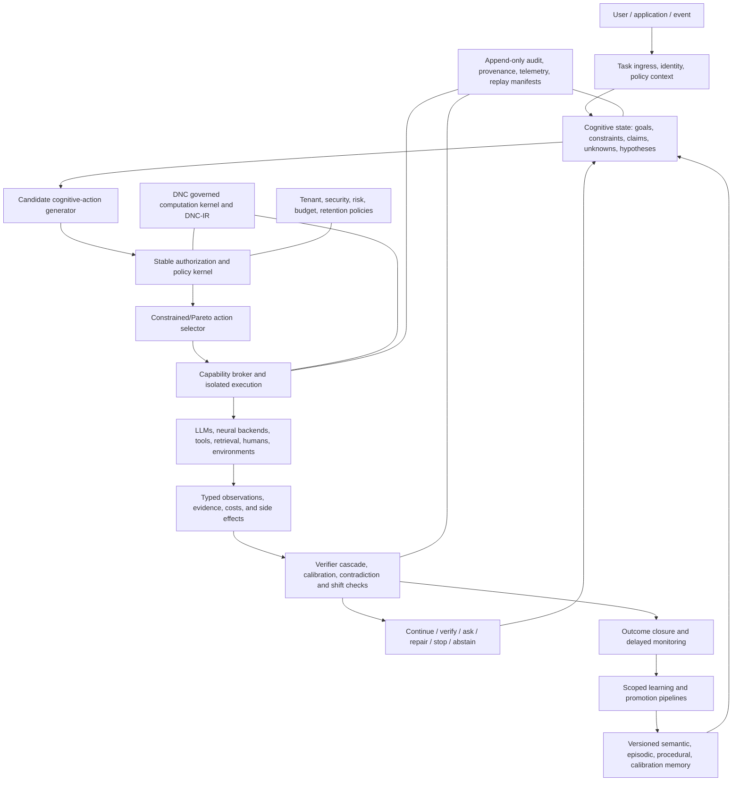

# Dynamic Neural Computing (DNC): Exhaustive Future Implementation Master Plan

**Document status:** Implementation-planning authority; not a claim that the described capabilities already exist
**Prepared:** 2026-07-31
**Primary intent source:** `outputs/DNC_INTENT_VS_IMPLEMENTATION_REVIEW_HANDOFF.md`
**Public source baseline inspected:** `shreyashjagtap157/Dynamic-Neural-Computing`, public `main` merge commit `baa510677b606e95160ced2e27693f62bbcb1855`
**Additional reported baseline:** commit `5e54c10`, 194 tests, same-state candidate sandbox and `NO_OP` authorization gate, described in the supplied handoff but not present in the inspected public source
**Audience:** product owner, research lead, architecture lead, implementation teams, safety/security reviewers, test/evaluation engineers, enterprise platform owners, and future Codex sessions

---

## 1. How to use this document

This is the forward implementation authority for turning the present DNC codebase into the intended system. It is deliberately more specific than a product vision and more cautious than a conventional backlog. It defines:

- what source evidence was and was not available;
- what DNC is intended to become;
- which current components are reusable foundations;
- the architectural boundaries that must not be blurred;
- the contracts, state machines, algorithms, schemas, adapters, and controls to implement;
- the order in which work must occur;
- phase entry criteria, deliverables, tests, exit gates, and rollback rules;
- compatibility traps across models, frameworks, runtimes, storage, distributed execution, security, and evaluation;
- the evidence required before any maturity or enterprise-readiness claim is made.

This plan is exhaustive in scope, but no planning document can guarantee the absence of future discoveries. The way to minimize rework is to preserve versioned contracts, use adapters at volatile boundaries, test assumptions before irreversible migrations, and refuse to advance when phase evidence is incomplete. Those safeguards are part of the plan rather than optional process advice.

### 1.1 Required reading order

1. Sections 2–6 establish truth, intent, and non-negotiable design decisions.
2. Sections 7–15 define the target system and contracts.
3. Sections 16–20 define compatibility, security, evaluation, and dependency policy.
4. Section 21 is the complete implementation sequence.
5. Sections 22–27 define gates, risks, work ownership, immediate actions, and source material.

### 1.2 Normative language

`MUST`, `MUST NOT`, `SHOULD`, and `MAY` are used deliberately. A phase may not waive a `MUST` without an accepted architecture decision record (ADR), migration plan, and explicit product-owner approval.

---

## 2. Evidence boundary and source-baseline reconciliation

### 2.1 What was directly inspected

The public repository was reviewed at commit `baa510677b606e95160ced2e27693f62bbcb1855`, including its package layout, lifecycle, DNC-IR, transactions, invariants, planner/controller, learning and continual-learning foundations, neural contracts and PyTorch adapter, runtime protocol, providers, evaluation harness, distributed primitives, status/roadmap documents, frozen theory specification, and declared dependencies.

The inspected public baseline describes approximately 186 passing tests and package version `0.1.0.dev0`. It provides a dependency-light governed structural-computation kernel and synthetic evaluation foundations. It does not provide the complete cognitive/metacognitive product described by the owner’s intent.

### 2.2 What was supplied as documentary evidence only

The prior handoff states that a later commit `5e54c10` exists with 194 passing tests, a same-state candidate counterfactual sandbox, measured candidate versus `NO_OP` evidence, source-state preservation, and improved canonical serialization. That source was not present in this workspace and was not found on the inspected public branch. Therefore:

- this plan incorporates those features as **reported foundations**;
- it does not treat their exact APIs, security properties, or test results as independently verified;
- Phase -1 requires locating and reconciling that revision before implementation begins;
- no developer may recreate the reported changes from prose if the actual source can be recovered.

### 2.3 Baseline reconciliation gate

Before feature work, create `docs/baselines/DNC-SOURCE-BASELINE.md` containing:

- repository remote, branch, and exact commit SHA;
- whether `5e54c10` was recovered, superseded, or proven unavailable;
- clean/dirty worktree status and an inventory of uncommitted owner changes;
- Python version, operating system, accelerator/toolchain versions, dependency lock hashes, and test commands;
- unit, integration, conformance, audit, benchmark, and build results;
- differences between the public 186-test baseline and the reported 194-test baseline;
- the authoritative starting commit for every subsequent work item.

**Stop condition:** if the newer revision cannot be found, pause implementation after documenting the gap. The product owner must choose whether to recover it or deliberately restart from the public baseline. This is the only safe way to avoid two divergent DNC histories.

---

## 3. Intended product definition

DNC is to be a **governed cognitive and computation runtime that dynamically chooses what kind of cognitive work to perform, how much computation to spend, which capabilities to use, what evidence is sufficient, when to repair or restructure itself, and when to stop or abstain**.

It is not merely:

- an LLM wrapper that repeats prompts;
- a confidence threshold around a static model;
- a neural-network early-exit mechanism;
- an agent loop with unrestricted tools;
- a graph mutation framework;
- a model router;
- a memory/vector-search product;
- an online self-modifying system; or
- a synthetic benchmark harness.

Those can be components. The intended product is their disciplined integration under explicit semantics, evidence, authorization, isolation, and lifecycle control.

### 3.1 Required cognitive actions

The controller must reason over a typed action space, initially including:

`REASON`, `CONTINUE`, `BRANCH`, `VERIFY`, `RETRIEVE`, `OBSERVE_OR_TEST`, `ASK`, `REPAIR`, `REUSE_SKILL`, `RESTRUCTURE`, `ESCALATE`, `RESUME`, `STOP`, and `ABSTAIN`.

Each action is a governed proposal with preconditions, expected effects, evidence requirements, costs, risks, reversibility, authorization, execution record, and outcome assessment. It is not a free-form string emitted by a model.

### 3.2 Three levels of adaptive computation

DNC must eventually support three distinct mechanisms without pretending they are interchangeable:

1. **Attempt/sample-level control:** decide whether another independent or diverse reasoning attempt is worth its cost.
2. **Trajectory/action-level control:** decide the next cognitive act within an ongoing task.
3. **Layer/token-level control:** for locally controlled models with compatible training and architecture, dynamically allocate neural depth or token computation.

Hosted model APIs usually permit the first two but not the third. Layer-level early exit is an optional neural-runtime profile, never a universal DNC assumption.

### 3.3 Confidence and stopping intent

The owner’s “above 90% correct” idea must be implemented as calibrated risk control, not literal model self-confidence. A response may stop early only when all applicable conditions hold:

- mandatory task and policy checks pass;
- the calibrated probability or risk bound meets the task’s risk-class threshold;
- no unresolved critical contradiction remains;
- important atomic claims have appropriate evidence or verifier coverage;
- the answer is semantically stable enough for the task;
- expected marginal quality or information gain from another action is not worth its cost, latency, or risk;
- no required human approval, external observation, or delayed outcome is outstanding.

The threshold must be policy-defined by risk class and calibration domain. It must not be a hard-coded global `0.90`. Agreement among repeated generations is evidence of stability, not proof of correctness.

### 3.4 Product outcomes

A mature DNC should:

- solve easy tasks with less computation than fixed-depth/fixed-attempt baselines;
- spend more computation on ambiguous, novel, adversarial, or high-risk tasks;
- choose verification, retrieval, experimentation, clarification, repair, escalation, or abstention when those dominate more generation;
- preserve goals, constraints, evidence lineage, and security boundaries while adapting;
- learn reusable, versioned skills from verified outcomes without silently changing the stable kernel;
- expose structured decision evidence without exposing private hidden chain-of-thought;
- run across provider APIs, local neural backends, symbolic tools, and enterprise systems through capability-negotiated adapters;
- remain replayable to the degree its external environment permits, with honest reproducibility grades;
- demonstrate benefits on hidden, outcome-grounded workloads rather than synthetic telemetry alone.

---

## 4. Current implementation: reusable foundations and actual gaps

### 4.1 Foundations to preserve

The current codebase contains valuable kernel components:

- a canonical lifecycle resembling `GENERATE → AUTHORIZE → TRANSACT → EXECUTE → ASSESS → LEARN`;
- DNC-IR graph, unit, edge, operation, validation, canonical serialization, mutation, projection, replay, and transaction concepts;
- stable invariants and structural authorization boundaries;
- computation generator and structural controller scaffolding;
- assessment, prediction error, knowledge, drift, simulation, and circuit-breaker foundations;
- neural backend protocols, tensor/parameter/cache/quantization/compilation contracts, and a PyTorch adapter foundation;
- runtime checkpoints, traces, Observe/Decide/Act/Assess concepts, providers, evaluation harnesses, and distributed protocols;
- synthetic conformance and benchmark machinery;
- reported same-state candidate/`NO_OP` counterfactual evaluation.

These should become the governed execution kernel beneath the cognitive layer. They should not be discarded or overloaded with ambiguous new meanings.

### 4.2 Principal intent gaps

| Area | Current foundation | Required destination | Main implementation gap |
|---|---|---|---|
| Semantics | Structural graph units and operations | Task, claim, hypothesis, evidence, capability, verifier, action, outcome semantics | No canonical epistemic/cognitive schema |
| Controller | Heuristic proposal scoring and runtime actions such as continue/replan/pause/terminate/rollback | Typed cognitive action selection under constraints, uncertainty, cost, risk, and reversibility | Scalar structural score is insufficient |
| Confidence | Synthetic utility/assessment and candidate delta | Calibrated correctness/risk estimates by domain and risk class | No calibration registry, coverage/risk curves, or shift handling |
| Halting | Lifecycle termination and structural `NO_OP` | Attempt-, trajectory-, and optional layer-level stopping | No evidence-aware marginal-value policy |
| Verification | Invariants and execution assessment | Claim-level deterministic, model-based, external, and delayed-outcome verification | No verifier registry or assurance cascade |
| Hypotheses | Structural candidate proposals | Competing semantic hypotheses with predicted observations and falsifiers | No explicit hypothesis portfolio |
| Capabilities | Backends/providers/tools as implementation modules | Governed capability cards with competence, calibration, permissions, cost, and failure modes | No capability self-model |
| Learning | Heuristic knowledge and continual-learning scaffold | Outcome-grounded semantic, procedural, controller, and neural learning tracks | No strict learning scopes or promotion workflow |
| Repair | Rollback/graph mutation | Dependency-aware local belief/plan/skill repair | No provenance-driven invalidation |
| Memory | State/checkpoints/knowledge structures | Epistemic, episodic, semantic, procedural, and audit memory with ACL/retention | No durable governed memory architecture |
| Counterfactuals | Reported clone-based graph sandbox | Isolation-graded, side-effect-safe experimentation with causal limits | Graph cloning cannot isolate providers, RNG, tools, caches, or databases |
| Neural adaptation | PyTorch contracts | Trainable early exit/routing and backend-specific profiles | No training/evaluation pipeline for adaptive depth |
| Enterprise | Protocols and development package | Tenant isolation, IAM, policy, secrets, persistence, SLOs, audit, supply-chain controls | Production platform is absent |
| Scientific proof | Synthetic diagnostic campaigns | Hidden outcome-grounded tasks and statistically valid comparisons | Existing telemetry cannot establish DNC benefit |

### 4.3 Frozen-theory compatibility problem

The inspected frozen specification defines DNC primarily as governed structural mutation and explicitly leaves decision, learning, and consolidation algorithms unspecified. The expanded owner intent is broader. Silently rewriting the frozen document would destroy historical traceability; forcing the expanded intent into its old maturity scale would create semantic contradictions.

The solution is a versioned governance change:

- preserve the frozen structural-kernel definition as the historical **DNC Kernel profile**;
- author an owner-approved RFC that defines the broader **DNC Cognitive Runtime profile**;
- define orthogonal maturity dimensions rather than one overloaded number:
  - **K** — governed computation kernel and structural mutation;
  - **C** — cognitive/metacognitive control;
  - **N** — neural adaptive computation and training;
  - **E** — enterprise operations, security, and governance;
- keep the old `DNC-0…DNC-6` terminology only as a documented historical compatibility alias.

No phase may claim the broader product solely because the K profile has matured.

---

## 5. Non-negotiable architecture decisions

1. **Stable kernel, adaptive policies.** Invariants, authorization, canonical state, evidence integrity, and rollback remain deterministic and tightly controlled. Models may propose; they do not bypass the kernel.
2. **Hard constraints precede utility.** Safety, authorization, tenant boundaries, objective invariants, and irreversible-action rules are lexicographic gates, not negative weights in one scalar score.
3. **Typed semantics precede learned control.** Implement deterministic contracts and policies before training a controller. Learning an undefined action space would lock ambiguity into data.
4. **`NO_OP` and `STOP` remain different.** `NO_OP` compares structural mutation with preserving graph state. `STOP` decides whether task-level evidence is sufficient. One must never substitute for the other.
5. **Evidence is not confidence.** Evidence items, verifier outcomes, calibration estimates, semantic agreement, and final halting decisions remain separate typed objects.
6. **No universal confidence threshold.** Thresholds are risk-class, domain, model/version, verifier, and distribution specific.
7. **No vote-equals-truth rule.** Self-consistency can improve estimates, but correlated samples may confidently agree on the same error.
8. **Isolation is graded and explicit.** A clone of DNC-IR is not a clone of provider state, accelerator state, RNG, filesystem, database, cache, network, or world state.
9. **External side effects are deny-by-default.** Speculation and replay use recordings, mocks, transactions, sandboxes, or explicit approval; they do not duplicate live effects.
10. **Provider capabilities are negotiated.** Unsupported streaming, seeds, log probabilities, tool calls, structured output, cancellation, or snapshots must be reported, never simulated invisibly.
11. **Learning scopes remain separate.** Semantic memory, procedural skills, controller policies, calibrators, and neural weights have independent promotion and rollback lifecycles.
12. **Online learning starts in shadow mode.** Production decisions cannot be changed by a newly learned controller until logged propensities, offline evaluation, safety constraints, canaries, and rollback are proven.
13. **Reasoning privacy is preserved.** Persist structured rationales, claims, evidence, policies, and decisions—not hidden chain-of-thought or unrestricted scratchpads.
14. **Interchange formats do not define canonical hashing.** DNC canonical serialization remains explicit. Raw Protocol Buffer bytes are not canonical and must not be used as state identity.
15. **Optional heavy dependencies stay isolated.** PyTorch, JAX, ONNX Runtime, serving engines, Ray, and databases live behind extras, services, or environment profiles; the kernel remains dependency-light.
16. **Every claim has a maturity grade.** “Prototype,” “experimentally supported,” “production hardened,” and “enterprise ready” have evidence gates.
17. **Migration is additive first.** Add new modules and compatibility facades before moving existing packages. Delete old interfaces only after a documented deprecation window and migration tests.
18. **Human authority is explicit.** Clarification, approval, escalation, incident response, and irreversible-action checkpoints are first-class states.

---

## 6. Target architecture



### 6.1 Architectural layers

| Layer | Responsibility | Must remain independent from |
|---|---|---|
| Ingress and policy context | Identity, tenant, task declaration, data classification, risk, budgets, deadlines | Model-generated policy claims |
| Cognitive state | Goals, invariants, claims, evidence, hypotheses, unknowns, plans, capabilities | Hidden provider scratchpads |
| Action generation | Generate feasible typed next actions and alternatives | Final authorization |
| Authorization/kernel | Enforce invariants, permissions, isolation, budgets, side-effect rules | Learned utility alone |
| Action selection | Compare authorized alternatives under uncertainty and multi-objective constraints | Backend-specific execution code |
| Capability broker | Match action requirements to capability cards; negotiate features | Assuming every model/tool behaves alike |
| Execution/sandbox | Run, cancel, checkpoint, record, replay, and clean up according to isolation grade | Claiming causal validity without isolation |
| Assurance | Verify claims/results; estimate calibrated risk; detect shift and contradiction | Treating fluent generation as evidence |
| Halting | Decide continue/stop/abstain/escalate from assurance state and marginal value | Structural `NO_OP` |
| Memory/learning | Store scoped knowledge and promote validated skills/policies/models | Mutating stable invariants |
| Persistence/audit | Durable events, artifacts, lineage, retention, tenant enforcement | Vector index as source of truth |
| Operations | Scheduling, durability, SLOs, incidents, rollout, security | Cognitive correctness semantics |

### 6.2 Control-loop order

Every cognitive step must follow this order:

1. normalize task and policy context;
2. update typed epistemic state from admissible observations;
3. enumerate feasible actions and explicit `STOP`/`ABSTAIN` alternatives;
4. apply hard goal, authorization, safety, tenant, resource, and side-effect constraints;
5. predict outcome vectors and uncertainty for remaining candidates;
6. remove dominated candidates and apply risk-class selection rules;
7. authorize the exact action/capability/inputs/isolation plan;
8. snapshot or create replay boundaries as supported;
9. execute with deadline, cancellation, idempotency, and cleanup;
10. ingest typed results as observations, not automatically as facts;
11. verify, calibrate, detect contradictions and distribution shift;
12. assess realized quality, information, cost, latency, risk, and effects;
13. update dependencies and invalidate affected downstream beliefs/plans;
14. decide the next action, `STOP`, `ABSTAIN`, or human escalation;
15. close immediate and delayed outcomes before learning promotion.

---

## 7. Canonical cognitive and assurance contracts

All contracts must have `schema_version`, stable identifiers, timestamps, tenant/security labels, producer identity/version, provenance links, and canonical serialization rules. Use JSON Schema 2020-12 for language-neutral validation at persistence/API boundaries and typed Python models internally. Protocol Buffers may be used for RPC after schemas stabilize, but not as the canonical state hash.

### 7.1 `TaskSpec`

Required fields:

- `task_id`, `parent_task_id`, `tenant_id`, `actor_id`, `session_id`;
- normalized objective and expected output contract;
- objective invariants and prohibited outcomes;
- hard constraints and soft preferences;
- domain, risk class, data classification, jurisdiction tags;
- budgets: tokens, money, wall time, accelerator time, tool calls, branch count, attempt count;
- deadline and cancellation policy;
- required evidence/verification types;
- acceptable uncertainty, abstention, and escalation rules;
- side-effect class: none, reversible, compensatable, irreversible;
- retention and audit policy;
- user-provided sources distinguished from system and retrieved sources.

### 7.2 `ObjectiveInvariant` and `Constraint`

Each invariant/constraint includes:

- machine-readable predicate where possible;
- natural-language label for review;
- enforcement tier: invariant, constraint, policy, preference;
- scope and activation condition;
- violation severity;
- detector/verifier version;
- override authority and whether override is forbidden;
- remediation or escalation action.

### 7.3 `EpistemicItem`

Statuses must include:

- `VERIFIED_FACT`
- `DIRECT_OBSERVATION`
- `RETRIEVED_CLAIM`
- `MODEL_INFERENCE`
- `ASSUMPTION`
- `PREDICTION`
- `CONFLICT`
- `UNKNOWN`
- `CAPABILITY_LIMIT`
- `UNVERIFIABLE`
- `RETRACTED`

Required fields include normalized claim, subject/predicate/object or compatible structured representation, scope, temporal validity, confidence estimate reference, evidence references, independence group, supporting and contradicting relations, dependency parents, freshness/expiry, security labels, and invalidation status.

No retrieved passage, model output, or tool output becomes `VERIFIED_FACT` merely because it was returned successfully.

### 7.4 `EvidenceRef`

Evidence records include:

- content-addressed artifact reference, not uncontrolled inline duplication;
- source type, source identity, acquisition time, and freshness;
- trust policy and authority level;
- independence/correlation group;
- chain of custody and transformation lineage;
- access-control and tenant labels;
- prompt-injection/untrusted-content status;
- signature/attestation where applicable;
- verifier results and contradictory evidence;
- retention/deletion obligations.

### 7.5 `Hypothesis`

Each hypothesis includes:

- proposition and scope;
- prior/posterior estimate or qualitative uncertainty class;
- supporting and contradicting evidence;
- assumptions and dependency graph;
- predicted observations;
- strongest feasible falsifier/test;
- discriminating actions relative to competing hypotheses;
- decision relevance and cost of being wrong;
- status: proposed, active, weakened, falsified, supported, accepted-for-action, retired.

“Accepted-for-action” must not be mislabeled as objective truth.

### 7.6 `CognitiveActionProposal`

Fields:

- action type and target state elements;
- action-specific typed payload;
- preconditions and required capabilities;
- expected observations and state transitions;
- expected vector: quality gain, information gain, cost, latency, operational risk, epistemic risk, privacy/security risk, reversibility, side-effect magnitude;
- uncertainty/interval for every prediction;
- alternatives considered, including `STOP`, `ABSTAIN`, and safe `NO_OP` where relevant;
- isolation grade and snapshot/replay requirements;
- deadline, retry, cancellation, idempotency, and compensation plan;
- proposed capability and evidence for its competence;
- generator/model/template/version provenance.

### 7.7 `ActionDecision`

Fields:

- candidate set identity;
- constraints and policy versions applied;
- feasibility failures and rejected reasons;
- dominance/Pareto result;
- selected proposal and selection rule;
- human approval requirement/status;
- exact authorization scope and expiry;
- structured rationale codes and evidence references;
- randomization probability/propensity if exploration is allowed.

Do not store private chain-of-thought. Store inspectable factors, thresholds, policies, alternatives, and evidence.

### 7.8 `ActionOutcome`

Fields:

- action/attempt/trace identity;
- execution status, observations, artifacts, and exceptions;
- provider/backend/model/tool and version fingerprints;
- prompt/template, decoding, seed, and capability settings where retainable;
- snapshot/replay/isolation grade;
- realized token, money, compute, energy-estimate, latency, and tool costs;
- side effects and compensation status;
- verifier results, contradictions, calibrated confidence, and shift status;
- predicted-versus-realized deltas;
- immediate outcome and delayed outcome references;
- cleanup confirmation.

### 7.9 `ConfidenceEstimate`

Fields:

- target object: answer, conclusion, atomic claim, action, plan, capability, or outcome;
- estimate such as `p_correct`, failure probability, or conformal risk/coverage bound;
- lower/upper bounds and method;
- calibration model, dataset, split, domain, risk class, and version;
- model/provider/prompt/verifier fingerprints for which calibration is valid;
- sample count, semantic clusters, correlation/independence assumptions;
- held-out metrics: Brier score, log loss, reliability data, risk-coverage curve, selective accuracy;
- distribution-shift indicators and applicability status;
- status: calibrated, extrapolated, shifted, insufficient-data, unavailable.

### 7.10 `HaltingDecision`

Fields:

- decision: continue, verify, retrieve, test, ask, repair, escalate, stop, or abstain;
- risk threshold and policy source;
- mandatory-check outcomes;
- calibrated bound and applicability;
- unresolved contradictions/unknowns;
- semantic stability assessment;
- estimated marginal value, cost, latency, and risk of best next action;
- remaining budgets;
- final answer/output artifact reference if stopping;
- reason codes and audit record.

### 7.11 `CapabilityCard`

Every model, verifier, retriever, tool, human role, environment, and neural backend exposes a versioned card:

- supported action types, schemas, domains, modalities, context/output limits;
- competence and calibration evidence by domain/risk class;
- supported features: streaming, cancellation, structured output, tool calling, log probabilities, seeding, snapshots, batching, compilation, gradients;
- costs, latency distributions, concurrency/rate limits, locality, and availability;
- permissions, data residency, data retention, training-on-data status;
- side effects, reversibility, idempotency, isolation grade;
- known failure modes and security risks;
- health status and circuit-breaker state;
- version, owner, dependencies, attestations, expiry/revalidation date.

### 7.12 `SkillManifest`

A reusable skill must include:

- semantic purpose and version;
- input/output schemas;
- preconditions, postconditions, and invariants;
- capability dependencies and minimum versions;
- policy/permission requirements;
- deterministic checks and evaluation suite;
- competence/calibration envelope;
- known failures and excluded domains;
- provenance from verified episodes;
- security review/signature/attestation;
- promotion stage, owner, expiry, invalidation triggers, rollback target.

### 7.13 `SnapshotManifest` and reproducibility grade

Snapshot manifests enumerate every captured or intentionally uncaptured state component:

- DNC canonical graph and cognitive state;
- model weights, adapters, buffers, optimizer, scheduler, gradient scaler;
- CPU and all accelerator RNG states, framework PRNG keys, data sampler/dataloader position;
- caches, compilation artifacts/fingerprints, tokenizer/template/config;
- provider responses or replay cassettes;
- filesystem/object/database transaction references;
- external tool/environment state;
- deadlines, leases, active side effects, cleanup handles;
- source and dependency hashes.

Assign one grade:

- **R0 — trace only:** inputs/outputs recorded; no deterministic replay claim.
- **R1 — logical replay:** DNC decisions can be replayed from recorded outcomes.
- **R2 — process replay:** local process state and RNG captured; hardware nondeterminism may remain.
- **R3 — environment replay:** container/dependencies/data/tools captured or content-addressed.
- **R4 — deterministic experimental replay:** validated bitwise or tolerance-bounded replay on a declared hardware/software profile.

Never use “same-state” without naming the grade and uncaptured state.

---

## 8. State machines

### 8.1 Task lifecycle

`RECEIVED → NORMALIZED → POLICY_BOUND → ACTIVE → {WAITING_INPUT | WAITING_APPROVAL | WAITING_OUTCOME | PAUSED | ACTIVE} → {COMPLETED | ABSTAINED | CANCELLED | FAILED | ESCALATED}`

Rules:

- terminal states are immutable; corrections create a superseding task/outcome record;
- cancellation propagates to branches and capabilities, followed by verified cleanup;
- waiting states retain deadlines and ownership;
- failure does not authorize unbounded retries;
- completion requires the output contract and closure checks, not merely generation success.

### 8.2 Cognitive-action lifecycle

`PROPOSED → VALIDATED → POLICY_CHECKED → AUTHORIZED → PREPARED → EXECUTING → OBSERVED → VERIFIED → ASSESSED → CLOSED`

Alternative terminal states: `REJECTED`, `CANCELLED`, `TIMED_OUT`, `FAILED`, `COMPENSATION_REQUIRED`, `QUARANTINED`.

Every transition is idempotent and event-backed. Authorization is bound to exact inputs, capability version, policy version, time window, and side-effect scope.

### 8.3 Hypothesis lifecycle

`PROPOSED → ACTIVE → TEST_PLANNED → OBSERVATION_RECEIVED → {SUPPORTED | WEAKENED | FALSIFIED | UNRESOLVED} → {ACCEPTED_FOR_ACTION | RETIRED}`

Contradictory evidence reopens a supported hypothesis; it must not be overwritten.

### 8.4 Skill lifecycle

`DRAFT → SANDBOXED → EVALUATED → SHADOW → CANARY → APPROVED → ACTIVE → {DEGRADED | SUSPENDED | DEPRECATED | REVOKED}`

Promotion requires immutable evaluation artifacts and independent approval for high-risk permissions. Rollback must be one operation against a versioned registry.

### 8.5 Outcome lifecycle

`PREDICTED → IMMEDIATE_OBSERVED → INTERIM_ASSESSED → DELAYED_PENDING → DELAYED_OBSERVED → CLOSED → LEARNING_ELIGIBLE`

Learning from proxy rewards before delayed outcomes arrive must be explicitly labeled and corrected when the real outcome arrives.

---

## 9. Core algorithms and initial implementation choices

### 9.1 Semantic task analysis

Initial implementation should be hybrid and conservative:

1. deterministic parsing of API-declared schemas, permissions, budgets, and risk;
2. model-assisted extraction of objectives, atomic claims, unknowns, ambiguities, and proposed constraints;
3. schema validation and conflict checks;
4. user clarification for material ambiguity;
5. deterministic policy binding;
6. immutable normalized `TaskSpec` with source spans/provenance.

Model-extracted constraints cannot silently override explicit user/system constraints. Ambiguous high-impact interpretations require `ASK` or `ESCALATE`.

### 9.2 Epistemic state update

Use an append-only claim/evidence graph with derived materialized views. On new evidence:

1. normalize the observation and retain its raw artifact;
2. assign source, trust, freshness, independence, tenant, and injection-risk metadata;
3. link support/contradiction/dependency edges;
4. run deterministic and domain verifiers;
5. update confidence through a versioned estimator rather than overwriting old values;
6. propagate invalidation to dependent conclusions/plans/skills;
7. trigger `REPAIR`, `VERIFY`, `ASK`, or `ABSTAIN` when critical dependencies become invalid.

Use probability only where its meaning and calibration are defensible. Otherwise use explicit qualitative uncertainty and insufficiency states.

### 9.3 Hypothesis portfolio and falsification

For nontrivial uncertain tasks, maintain multiple hypotheses rather than one narrative. Generate alternatives using diverse prompts/models/rules where appropriate, then select tests by expected discrimination:

`ExpectedValue(test) = decision_relevance × expected_information_gain − cost − latency_penalty − risk − irreversible_side_effect_penalty`

The exact scalarization must not absorb hard constraints. For high-risk tasks, prefer tests that can falsify the favored hypothesis, evidence from independent groups, and reversible observations. Limit portfolio size and merge semantically equivalent hypotheses.

### 9.4 Candidate action generation

Generate candidates from:

- deterministic rules keyed by missing evidence, contradictions, budget, risk, and lifecycle state;
- capability preconditions and skill matches;
- semantic planners/models constrained to the typed action schema;
- explicit alternatives: stop, abstain, ask, verify, retrieve, test, repair;
- branch-specific options when hypotheses predict different observations.

Deduplicate by semantic/action signature. Reject candidates with unbound inputs, unknown side effects, missing capabilities, invalid schemas, or unsupported isolation requirements.

### 9.5 Constrained multi-objective selection

The initial selector must be deterministic and auditable:

1. apply hard invariants and policies;
2. enforce feasibility, permissions, tenant, deadline, and remaining budgets;
3. require human approval where mandated;
4. estimate vector outcomes and uncertainty;
5. remove Pareto-dominated actions;
6. apply risk-class priorities lexicographically;
7. choose by configured utility only among policy-equivalent survivors;
8. record alternatives and reason codes.

Suggested vector:

`[expected_quality_gain, expected_information_gain, confidence_gain, monetary_cost, compute_cost, latency, epistemic_risk, safety/security_risk, privacy_risk, reversibility, side_effect_magnitude]`

Do not train this selector until outcome logging and offline evaluation are complete.

### 9.6 Verification cascade

Use the cheapest trustworthy verifier that is competent for the claim, escalating only as required:

1. schema/type/format/constraint checks;
2. deterministic execution, compilation, theorem/property checks, database constraints, or exact calculators;
3. source-grounding and provenance checks;
4. cross-check with independent data/tool/model;
5. adversarial/critic review with correlated-evidence labeling;
6. environment observation or controlled test;
7. human/domain-expert approval;
8. delayed real-world outcome.

Verifier success is scoped to what it checks. A format validator cannot increase factual correctness. A model critic from the same family is not independent evidence unless demonstrated.

### 9.7 Confidence calibration

Implement a calibration registry keyed by domain, risk class, model/provider/version, prompt/template, decoding regime, verifier set, and task distribution. Start with held-out supervised outcomes and compare:

- temperature or logistic calibration for suitable logits/scores;
- isotonic calibration where data volume supports it;
- Brier score and log loss;
- reliability diagrams and calibration error with binning sensitivity disclosed;
- selective accuracy and risk-coverage curves;
- bootstrap confidence intervals;
- conformal prediction/risk control where exchangeability assumptions are credible;
- subgroup and shifted-distribution results.

When applicability is unknown or shift is detected, downgrade status to `SHIFTED` or `INSUFFICIENT_DATA`; do not reuse the old 90% interpretation.

### 9.8 Semantic agreement and attempt-level stopping

Repeated reasoning should be clustered by normalized final conclusion and important atomic claims, not surface text. Track:

- number and weight of semantic clusters;
- verifier coverage within clusters;
- sample correlation: same model, prompt, seed family, retrieval source, or training lineage;
- minority hypotheses and whether a decisive test exists;
- marginal change in calibrated risk as samples are added.

Stop sampling when mandatory checks pass and the expected improvement from the best additional sample/verification action falls below its policy-adjusted cost. Continue, diversify, or verify when agreement is high but evidence is weak or correlated.

### 9.9 General halting rule

For a task state `s`, define the best authorized next action `a*`. Stop only if:

```text
mandatory_checks(s) = PASS
and applicable_calibrated_lower_bound(s) >= threshold(risk_class, domain)
and critical_contradictions(s) = 0
and output_contract(s) = SATISFIED
and expected_marginal_value(a* | s) <= policy_adjusted_cost_and_risk(a* | s)
```

If confidence is unavailable, the system may stop only under a separate deterministic-evidence policy or must `ABSTAIN`/`ESCALATE`. Budget exhaustion does not convert uncertainty into correctness.

### 9.10 Localized repair

On failed verification or contradictory evidence:

1. locate the smallest invalid dependency cut;
2. mark downstream claims/plans/actions/skills stale without erasing history;
3. retain unaffected verified components;
4. generate repair candidates scoped to the cut;
5. compare repair, branch, rollback, full recomputation, ask, and abstain;
6. run repair transactionally;
7. reverify all dependents whose validity changed;
8. measure avoided recomputation and correctness versus full recomputation.

The system must not “patch” the final answer while leaving invalid supporting state active.

### 9.11 Memory and skill consolidation

Separate stores and policies:

- **working memory:** task-local, short-lived cognitive state;
- **episodic memory:** immutable action/outcome episodes;
- **semantic memory:** claims/evidence with provenance, expiry, and contradiction;
- **procedural memory:** versioned skills and execution recipes;
- **calibration memory:** outcome labels and estimator artifacts;
- **audit memory:** policy, authorization, identity, and lineage events.

Skill induction requires multiple verified episodes or an explicitly approved one-shot rule, generalized pre/postconditions, negative examples, sandbox evaluation, permission minimization, and promotion gates. Retrieval can propose a skill; authorization and current validation remain required.

### 9.12 Cognitive compression

Long-running state must be compacted without losing decision-critical information:

- preserve objectives, invariants, open unknowns, active hypotheses, contradictions, decisions, evidence/provenance, and rollback anchors;
- summarize redundant observations into derived views while keeping immutable raw artifacts by retention policy;
- verify that compressed state reproduces selected decisions within declared tolerance;
- attach the compressor model/version and an information-loss report;
- never summarize away a security label, unresolved conflict, human condition, or expiry.

### 9.13 Learning-controller progression

Use this order:

1. deterministic constrained policy;
2. shadow outcome predictors;
3. contextual-bandit experiments with explicit exploration constraints and propensity logging;
4. offline policy evaluation using inverse-propensity, doubly robust, and sensitivity analyses;
5. shadow policy comparison;
6. low-risk canary with kill switch;
7. guarded broader rollout;
8. only then consider model-predictive control, search, or reinforcement learning.

Never start with end-to-end online RL. Sparse/proxy rewards, distribution shift, unsafe exploration, reward hacking, and missing counterfactual outcomes make it the highest-rework path.

### 9.14 Optional layer/token-level adaptive depth

Treat adaptive depth as a separate N-profile research program:

- train and validate early-exit heads or native exit-compatible objectives;
- or implement token-wise depth routing/mixture-of-depths in a model trained for it;
- measure calibration at each exit, accuracy/cost curves, tail risk, and shifted performance;
- integrate exit decisions as neural-backend evidence, not as the task-level halting decision;
- fall back to full depth on uncertainty, unsupported shapes, verifier disagreement, or risk policy;
- retain a full-depth reference path for regression and rollback.

Do not skip arbitrary transformer layers in an existing pretrained model and assume semantic preservation.

---

## 10. Execution, isolation, counterfactual, and replay architecture

### 10.1 Isolation grades

Define and enforce:

| Grade | Environment | Permitted use | Prohibited claim |
|---|---|---|---|
| I0 | Shared in-process state | Read-only deterministic diagnostics | Same-state or side-effect isolation |
| I1 | Transactional DNC state clone | Pure kernel/IR experiments | Isolation of model, cache, RNG, tool, network, DB, filesystem |
| I2 | Dedicated process with captured local state | Local backend experiments with no external effects | Isolation of external providers/world |
| I3 | Container/sandbox with controlled filesystem/network and transactional services | Tool/code experiments and integration tests | Perfect host isolation unless validated |
| I4 | Strong sandbox/microVM plus immutable dependencies, controlled egress, replayed external inputs | Untrusted code and high-assurance experiments | Replay of uncontrolled real-world effects |

Every proposal declares the minimum grade. The executor refuses downgrade unless a policy-approved alternative explicitly changes the evidence claim.

### 10.2 Snapshot-capable execution-core contract

Create a versioned protocol with:

- `capabilities()`
- `prepare(request, policy_context)`
- `snapshot(scope) -> SnapshotManifest`
- `execute(prepared, deadline, cancellation, idempotency_key)`
- `checkpoint()` for resumable long work
- `restore(snapshot)`
- `observe_effects()`
- `compensate(effect_refs)`
- `cleanup()`
- `fingerprint()`
- `health()`

Every method returns typed evidence. `cleanup()` runs on success, failure, timeout, cancellation, and process loss through a reconciler.

### 10.3 External provider limitation

Hosted LLM providers cannot generally expose full model state, RNG, caches, or deterministic replay. For them:

- record exact request, response, model alias/version if supplied, headers relevant to limits/cost, timing, and provider request ID;
- use replay cassettes for counterfactual controller tests;
- label live repeated calls as new stochastic observations, not same-state branches;
- segregate speculative calls from side-effecting tools;
- recalibrate whenever provider/model behavior changes;
- never claim causal isolation beyond the recorded request boundary.

### 10.4 Side-effect controls

- All actions carry an idempotency key and side-effect classification.
- Reversible/compensatable effects require tested compensation handlers.
- Irreversible effects require explicit policy/human approval and cannot be speculative.
- Use transactional outbox/inbox patterns for messaging and external commands.
- Do not retry non-idempotent effects automatically after ambiguous timeout.
- Cache keys include tenant, policy, model/tool/version, normalized input, security scope, and freshness.
- Counterfactual branches use read-only or partitioned caches and never contaminate canonical learning data before promotion.

### 10.5 Reproducibility reality

Exact seeds do not guarantee exact results across GPU kernels, compiler versions, distributed schedules, provider changes, or hardware. Report the reproducibility grade, tolerance, platform fingerprint, and observed replay rate. Scientific reports must distinguish deterministic replay, statistical reproducibility, and logical trace replay.

---

## 11. Backend and capability profiles

### 11.1 Hosted/API LLM profile

Implement a provider-neutral request/result schema and per-provider adapters. Capability negotiation covers models, context, structured outputs, tools, streaming, cancellation, usage, log probabilities, seeds, batch, data policy, and rate limits.

Required resilience:

- deadline propagation and connection/read timeouts;
- bounded retry with jitter only for safe/idempotent operations;
- rate-limit parsing, concurrency control, circuit breakers, and backpressure;
- streaming state machine with cancellation and partial-output policy;
- usage/cost reconciliation;
- schema-constrained output with repair limits;
- redaction and data-residency policy before dispatch;
- test doubles, response cassettes, and provider contract tests.

### 11.2 PyTorch profile

Keep dynamic DNC topology outside compiled model regions. Compile stable unit boundaries and cache by graph/unit signature, shapes, dtypes, device, backend/compiler settings, and parameter version. Test graph breaks, guard failures, recompilation limits, dynamic shapes, and eager fallback.

Snapshots include parameters, buffers, optimizer, scheduler, scaler, CPU/all-device RNG state, sampler position, and code/config fingerprints. Activation checkpointing’s RNG behavior must be tested; it is not a substitute for a full DNC snapshot.

### 11.3 JAX profile

Use a separate optional adapter or service environment. Treat PRNG keys as explicit state in every request/snapshot; use functional parameter/state trees and compilation-cache fingerprints. Do not emulate PyTorch’s implicit mutable state. JIT boundaries require stable shapes/control; dynamic DNC decisions stay outside or use deliberate staged primitives.

### 11.4 ONNX Runtime profile

Use ONNX for exported, relatively stable execution units. Negotiate execution providers and inspect provider assignment/fallback. Validate supported operators, opset, shapes, precision, and numerical tolerance per provider. Never assume a model tested on CPU will behave identically on CUDA/TensorRT/other providers. Isolate mutually conflicting provider packages/environments.

### 11.5 vLLM or inference-server profile

Prefer an HTTP/OpenAI-compatible service adapter to importing a serving engine into the kernel environment. Explicitly test structured outputs, tool calling, streaming, cancellation, prefix caching, model aliases, parallelism, quantization, usage accounting, and version-specific endpoints. DNC cache/state identity must not depend on undocumented server internals.

### 11.6 Symbolic/tool profile

Tools expose typed schemas, determinism, permissions, side effects, idempotency, deadlines, compensation, isolation grade, and evidence semantics. Shell/code/database/browser actions require allowlists and sandbox/transaction boundaries. Tool output is untrusted until validated and is never allowed to inject policy or authorization instructions.

### 11.7 Human capability profile

Human clarification, approval, review, and expert judgment are capabilities with role/authority, SLA, scope, conflict-of-interest, authentication, and audit requirements. A human response is authoritative only within its role and task scope.

---

## 12. Proposed package evolution

Do not perform an immediate repository-wide move. Add these namespaces alongside the existing kernel, expose compatibility facades, and migrate incrementally:

```text
src/dnc/
  kernel/                    # eventual home/facade for current IR, invariants, transaction, projection
  cognition/
    contracts.py             # TaskSpec, actions, hypotheses, decisions, outcomes
    task_state.py
    epistemic_state.py
    hypothesis_portfolio.py
    action_generator.py
    selector.py
    repair.py
    compression.py
  assurance/
    verifier_protocol.py
    registry.py
    deterministic/
    grounding/
    model_based/
    external/
    confidence.py
    calibration.py
    semantic_agreement.py
    shift.py
    halting.py
  capabilities/
    cards.py
    registry.py
    broker.py
    health.py
    adapters/
  execution/
    core_protocol.py
    snapshots.py
    isolation.py
    replay.py
    effects.py
    cancellation.py
  memory/
    working.py
    episodic.py
    semantic.py
    procedural.py
    calibration_store.py
    retention.py
  skills/
    manifests.py
    induction.py
    evaluator.py
    promotion.py
    registry.py
  policy/
    engine.py
    risk.py
    budgets.py
    approvals.py
    tenants.py
  persistence/
    events.py
    repositories.py
    migrations.py
    postgres/
    objects/
  telemetry/
    schema.py
    provenance.py
    exporters/
  learning/
    outcomes.py
    datasets.py
    off_policy.py
    controller_training.py
    neural_training.py
  enterprise/
    identity.py
    secrets.py
    audit.py
    compliance.py
```

### 12.1 Migration rules

- Existing imports continue through compatibility modules for at least two minor versions.
- Every move has contract tests proving canonical serialization/hashes and behavior remain stable.
- Schema changes use explicit migrations; never infer them from Python class shape alone.
- Public APIs get deprecation warnings, migration examples, and removal versions.
- The core package remains usable without neural, cloud, database, or distributed extras.
- No circular import from kernel into cognition/provider implementations.

---

## 13. Persistence and data architecture

### 13.1 Recommended storage roles

- **PostgreSQL:** authoritative metadata, tasks, events, claims/evidence indexes, decisions, policies, registry records, tenancy, idempotency, and promotion state.
- **S3-compatible object storage:** content-addressed raw artifacts, snapshots, model/calibration artifacts, large traces, benchmark outputs.
- **Arrow/Parquet:** versioned analytical and evaluation datasets.
- **pgvector (optional):** candidate retrieval index only; never evidence truth or authorization source.
- **Redis (optional and disposable):** short-lived coordination/rate limit/cache, never sole durable state.

Do not add a graph database until measured query/workload evidence shows PostgreSQL adjacency and recursive queries are insufficient. Avoiding an early second source of truth reduces consistency and operational risk.

### 13.2 Append-only event model

Persist immutable events with:

- monotonic aggregate version;
- globally unique event ID and causation/correlation IDs;
- tenant/actor/task/action/attempt identities;
- event/schema version;
- policy/model/capability fingerprints;
- payload/artifact digest;
- timestamp plus ordering semantics;
- signature/attestation as required;
- retention/security labels.

Materialized state is rebuilt or verified from events and snapshots. Concurrency uses optimistic version checks. Exactly-once claims are avoided across networks; idempotency and deduplication make effects effectively-once within a stated boundary.

### 13.3 PostgreSQL tenancy

- Use non-owner application roles and enable row-level security for tenant tables.
- Test that table owners/superusers/bypass roles cannot be used by normal services.
- Consider `FORCE ROW LEVEL SECURITY` where appropriate.
- Include tenant key in primary/unique indexes and every repository method.
- Maintain cross-tenant negative tests, migrations, backups, exports, and observability checks.
- Encrypt sensitive fields/artifacts and separate key-management authority.

### 13.4 Vector retrieval safeguards

- Apply tenant, ACL, trust, freshness, and data-classification filters.
- Measure approximate-index recall under filters; use iterative scans or exact reranking for critical retrieval.
- Store embedding model/version and reindex status.
- Detect stale/deleted source records.
- Treat similarity as discovery, not factual verification.
- Defend against poisoning and prompt injection in retrieved content.

---

## 14. Distributed and durable execution

### 14.1 Separation of concerns

The cognitive/kernel state machine defines correctness. A distributed runtime only schedules and resumes work. Do not let Ray, Temporal, Kubernetes, or a queue become the implicit semantic authority.

### 14.2 Recommended sequence

1. single-process deterministic reference runtime;
2. multiprocess execution with durable event store;
3. task queue/worker protocol with leases, heartbeats, idempotency, and reconciliation;
4. optional Ray adapter for parallel branches/model workers;
5. optional Temporal adapter for outer long-running business workflows;
6. Kubernetes deployment and autoscaling after SLO/load evidence.

### 14.3 Ray compatibility

Ray object reconstruction and actor restart semantics do not make external effects exactly once. Owner failure may affect object availability; lineage replay may repeat nondeterministic work. Therefore:

- persist authoritative events/artifacts outside Ray;
- make tasks idempotent or compensation-aware;
- restore actors from DNC snapshots rather than memory assumptions;
- partition by tenant/workload and enforce resource quotas;
- test node/owner/worker/network loss and duplicate delivery.

### 14.4 Temporal compatibility

Temporal workflow code must remain deterministic under replay. Do not place stochastic model/tool calls or mutable DNC decisions directly in workflow code. Put them in Activities; record their outcomes in history; use versioning/patching rules; use Temporal as an optional outer orchestrator for approvals, delays, and durable business steps.

### 14.5 Worker protocol

Every work item includes task/action IDs, expected aggregate version, capability/isolation requirements, deadline, retry class, idempotency key, trace context, tenant/policy labels, and artifact references. Workers emit heartbeats, checkpoints, effects, cleanup state, and a signed/fingerprinted result. A reconciler handles abandoned leases and ambiguous effects.

---

## 15. Observability, provenance, and accountability

### 15.1 Stable internal telemetry schema

Define internal versioned spans/events for:

- task and cognitive step;
- candidate generation and authorization;
- capability selection/health;
- execution, streaming, cancellation, retry, snapshot, restore, cleanup;
- verifier and calibration results;
- halting and abstention;
- policy and human approval;
- memory retrieval and skill use;
- outcome closure and learning promotion.

Export through adapters to OpenTelemetry. Because GenAI semantic conventions evolve, do not make internal storage or tests depend directly on unstable external attribute names.

### 15.2 Provenance

Map DNC entities/activities/agents to W3C PROV-O for export and interoperability. Use SHACL or equivalent validation for exported provenance shapes. Internal canonical traces may remain compact and optimized, but the mapping must preserve identity, derivation, attribution, generation, invalidation, and version information.

### 15.3 Structured decision record

Expose:

- objective, constraints, and risk class;
- actions considered and rule-coded rejection reasons;
- capability and policy versions;
- claims/evidence/verifier outcomes;
- confidence/calibration applicability;
- realized costs/effects;
- why the system stopped, abstained, or escalated.

Do not expose hidden chain-of-thought, provider secrets, personal data, proprietary raw prompts when policy forbids it, or untrusted retrieved instructions as if they were system rationale.

### 15.4 SLOs and alerts

Define SLOs per risk/workload class for availability, task completion, correctness proxy plus delayed outcome, calibrated coverage, abstention, latency, cost, cancellation, cleanup, audit completeness, and tenant isolation. Alert on calibration drift, verifier disagreement, policy denial spikes, budget overruns, retry storms, stale skills, cross-tenant anomalies, failed cleanup, and delayed-outcome deterioration.

---

## 16. Compatibility architecture and known traps

| Technology/technique | Appropriate role | Main incompatibility/trap | Required resolution |
|---|---|---|---|
| CALM/adaptive early exit | Per-token/layer compute in compatible local models | Needs internal layer access and trained/calibrated exits; unavailable for most hosted APIs | N-profile adapter; never universal controller logic |
| PonderNet-style halting | Learned computation steps | Training objective and halting prior; not a post-hoc wrapper | Research backend with full-depth fallback and held-out calibration |
| Mixture-of-Depths | Token-wise compute routing | Architectural/training-time change; arbitrary pretrained-layer skipping is unsafe | Train/fine-tune explicitly and benchmark tail risk |
| LayerSkip/self-speculative exit | Early exit and draft verification | Requires compatible training/model heads and serving integration | Treat as model-specific capability card |
| Self-consistency/adaptive sampling | Attempt-level allocation | Samples can be correlated and agree on a shared error | Semantic clustering, independence labels, verifier evidence, calibrated stopping |
| Conformal methods | Coverage/risk control | Guarantees rely on data/exchangeability assumptions and can fail under shift | Applicability checks, shift monitoring, recalibration/abstention |
| Tree/graph search | Hypothesis/reasoning branching | Exponential cost and evaluator/model bias | Bounded branching, typed states, falsification value, budgets, transposition/dedup |
| ReAct/tool use | Interleaved reasoning/actions | Prompt injection and excessive agency | Typed actions, untrusted-content boundary, least privilege, authorization |
| Reflection/self-refinement | Repair candidates | Same model can reinforce errors; no outcome guarantee | Independent/deterministic verification and repair budgets |
| Vector memory | Candidate retrieval | Similarity is neither truth nor permission; ANN filters can reduce recall | ACL/trust/freshness filters, rerank/verify, authoritative DB |
| PyTorch `torch.compile` | Stable neural unit acceleration | Dynamic Python control, graph breaks, guard/recompile explosion, version/hardware variation | Compile within unit boundaries, cache fingerprints, eager fallback |
| PyTorch checkpointing | Activation-memory reduction | RNG and recomputation semantics; not complete state snapshot | Snapshot full training/runtime state separately and test determinism |
| JAX | Functional accelerator backend | Explicit PRNG, immutable state, XLA shape/staging behavior differ from PyTorch | Separate adapter/env and native state semantics |
| ONNX Runtime | Portable stable unit inference | Opset/provider/operator/shape/precision variance and silent fallback risk | Provider qualification matrix and numerical tolerance tests |
| vLLM | High-throughput serving | Fast-moving server features, cache/scheduler internals, GPU dependency conflicts | Service boundary, pinned image/API contract tests |
| Protocol Buffers | RPC wire schema | Serialization not canonical; field evolution hazards | DNC canonical hash separately; reserve tags; compatibility tests |
| JSON Schema 2020-12 | Boundary validation | Validators/formats differ and schemas do not enforce all semantic invariants | Pin validator/dialect; kernel semantic validation remains authoritative |
| PostgreSQL RLS | Tenant data isolation | Owners/superusers/bypass roles can evade policies | Non-owner services, forced RLS where needed, negative tests |
| pgvector | Semantic candidate retrieval | Approximate recall/filtering, versioned embeddings, poisoned content | Exact rerank for critical tasks; never truth source |
| Ray | Parallel branches/actors | Retry/reconstruction can repeat side effects; object ownership semantics | Durable external state, idempotency, compensation, chaos tests |
| Temporal | Durable outer workflow | Replay requires deterministic workflow code | Model/tool calls in Activities; version workflows; DNC remains semantic authority |
| OpenTelemetry | Export/operations | GenAI conventions may change | Stable internal schema plus versioned exporter |
| OPA/Rego | Optional enterprise policy plane | External availability/latency; decision logs may leak sensitive data | In-process fail-closed minimum, cache/version bundles, redact logs |
| Containers/gVisor/Firecracker | Isolation | Different syscall/GPU/performance/support tradeoffs; container alone is not strong isolation | Workload-specific isolation grade and escape/egress tests |
| GPU stacks | Neural execution | CUDA/driver/compiler/PyTorch/JAX/ORT/vLLM matrices conflict | Separate locked images and qualification matrix; avoid one mega-environment |
| Hosted model aliases | API capability | Provider can change model behind alias, invalidating calibration | Record resolved version when possible; drift tests and automatic downgrade |
| Hidden chain-of-thought | Internal model behavior | Storage/exposure creates privacy, security, and product risks | Structured decision evidence only |

### 16.1 Compatibility qualification matrix

Maintain a generated matrix with rows for every supported environment and columns for OS/architecture, Python, accelerator driver/runtime, framework, compiler, model, quantization, serving backend, isolation grade, snapshot grade, deterministic tolerance, and passed test suites. A combination is unsupported until CI or a signed qualification run passes it.

### 16.2 Dependency/environment strategy

- Preserve a minimal `dnc-core` environment.
- Publish optional extras only for lightweight compatible clients.
- Use separate lockfiles/images for `pytorch`, `jax`, `onnxruntime-{cpu,cuda,...}`, `vllm-server`, `evaluation`, and `enterprise` profiles.
- Pin direct and resolved transitive versions for releases; generate hashes/SBOMs.
- Test minimum and maximum supported versions where semver compatibility is claimed.
- Never install mutually exclusive GPU/provider packages in the same production image unless explicitly qualified.
- Keep adapters protocol-driven so a backend can be upgraded independently.
- Add deprecation windows and migration tests for schema/API changes.

---

## 17. Security, safety, privacy, and enterprise governance

### 17.1 Threat model categories

At minimum cover:

- prompt injection and indirect injection through retrieved/tool content;
- excessive agency and unauthorized side effects;
- data exfiltration through prompts, tools, traces, embeddings, logs, or model providers;
- cross-tenant access and cache/vector contamination;
- poisoned evidence, memories, skills, calibration data, and model artifacts;
- insecure code/tool execution and sandbox escape;
- confused deputy and privilege escalation across capability broker/worker;
- replay, duplicate effects, stale authorization, and idempotency attacks;
- model/provider supply-chain changes and compromised dependencies;
- denial of wallet/service through branches, retries, tokens, GPU, or tools;
- audit tampering, provenance forgery, and deletion/retention conflicts;
- unsafe learning promotion, reward manipulation, and controller exploration;
- membership/privacy leakage and regulated-data violations.

### 17.2 Stable security kernel

- Authenticate users, services, workers, tools, and human approvers.
- Authorize exact actions using tenant, purpose, resource, data class, and side-effect scope.
- Use short-lived credentials/workload identities and external secret management.
- Enforce egress and tool allowlists at infrastructure and application levels.
- Classify retrieved/model content as untrusted data; it cannot change policy.
- Require two-person or policy-defined approval for high-impact irreversible actions.
- Sign and verify released skills, policies, models, images, and evaluation artifacts.
- Make policy/audit events append-only and independently monitored.
- Redact sensitive data before external providers and telemetry export.
- Define incident kill switches: capability, model, skill, tenant, action type, and global.

### 17.3 Policy engine

Keep a minimum fail-closed in-process policy layer for invariants, tenant isolation, budget, and action authorization. OPA/Rego may be an enterprise adapter for centrally managed policies. Bundle versions must be recorded with decisions; stale/unavailable external policy must follow explicit fail behavior; decision logs must be masked.

### 17.4 Isolation tiers

- pure deterministic library calls: constrained process;
- trusted tools with no effects: dedicated process/container;
- tools with network/data access: container/sandbox with identity, egress, filesystem, and time limits;
- untrusted generated code: strong sandbox such as gVisor or microVM where compatible;
- GPU code: dedicated trusted worker profile unless a validated accelerator-isolation design exists.

### 17.5 Governance frameworks

Map organizational controls to NIST AI RMF and its Generative AI profile without treating framework mapping as proof of safety. Use OWASP LLM risk categories to drive adversarial tests. Maintain model/system cards, data lineage, risk acceptance, human oversight, incident response, and periodic reevaluation.

### 17.6 Supply chain

- reproducible locked environments and isolated build workers;
- SBOM for Python, images, native libraries, models, and adapters;
- vulnerability/license scanning with documented exception handling;
- signed provenance targeting SLSA practices;
- Sigstore/cosign verification for images/artifacts where supported;
- content-addressed model/skill/calibrator artifacts;
- no unreviewed remote code execution from model repositories;
- release and rollback attestations.

---

## 18. Evaluation and scientific evidence program

### 18.1 Claims to test separately

Do not compress these into one aggregate score:

1. adaptive computation reduces cost/latency at matched quality;
2. calibrated stopping meets selective-risk targets;
3. cognitive action selection beats fixed loops and strong agent baselines;
4. verification/retrieval/testing are chosen appropriately;
5. local repair beats full recomputation without correctness loss;
6. semantic memory/skills improve future tasks without harmful transfer;
7. controller learning improves over deterministic policy safely;
8. layer-level adaptation improves neural efficiency at matched quality;
9. system survives distribution shift, faults, adversarial input, and long horizons;
10. enterprise controls preserve tenant/security/audit properties under load/failure.

### 18.2 Required baselines

- single-pass static LLM;
- fixed `k` samples plus majority/self-consistency;
- fixed iterative refinement;
- ReAct/tool loop with equivalent tools/budget;
- fixed planner/executor;
- current structural DNC kernel;
- oracle or exhaustive reference where feasible;
- ablations: no calibration, no verifier, no memory, no repair, no branching, no learned controller, no adaptive depth.

### 18.3 Workload families

- deterministic math/code/schema tasks with hidden checkers;
- evidence-grounded QA with source conflicts and freshness;
- interactive tool tasks requiring clarification/authorization;
- hidden environment shifts and changed tool/model behavior;
- fault injection: timeouts, partial streams, duplicate delivery, corrupt snapshots, stale caches, node/provider loss;
- long-horizon tasks with delayed outcomes and memory reuse;
- adversarial prompt injection, poisoning, excessive-agency traps, cross-tenant probes;
- neural adaptive-depth datasets with easy/hard/shifted strata;
- selected external suites such as SWE-bench, AgentBench, WebArena, GAIA, tau-bench, OSWorld, and HELM, pinned to versions and supplemented by fresh generated hidden tasks.

External benchmarks may be contaminated by training data and are not sufficient alone.

### 18.4 Experimental controls

- evaluator hidden from controller and generator;
- frozen estimator/calibrator during test;
- identical initial state and equivalent capability/budget exposure;
- paired tasks/seeds where meaningful;
- provider/model/template/tool versions recorded;
- repeated independent runs with uncertainty intervals;
- preregistered primary metrics and stopping/exclusion rules for major claims;
- no tuning on final hidden test;
- raw artifacts retained under policy;
- hardware/software/cost accounting;
- negative and null-result reporting.

### 18.5 Metrics

Quality and epistemics:

- exact/functional/domain-specific correctness;
- atomic-claim precision/recall and evidence coverage;
- Brier score, log loss, reliability, selective accuracy, risk-coverage;
- contradiction detection, abstention precision/recall, critical-failure rate;
- verifier false accept/reject by class;
- distribution-shift detection and post-shift risk.

Efficiency:

- tokens, attempts, layers, FLOP/accelerator time, wall time, monetary cost;
- branch/tool/retrieval counts;
- quality-cost and risk-cost Pareto curves;
- marginal gain per action;
- tail latency/cost and budget-violation rate.

Adaptation:

- shift detection delay;
- repair locality and avoided recomputation;
- skill transfer, harmful transfer, invalidation, and rollback;
- policy regret and off-policy confidence intervals;
- delayed-outcome improvement and stability.

Operations/security:

- SLO/error-budget compliance;
- cancellation/cleanup success;
- duplicate side-effect rate;
- recovery point/time;
- tenant-isolation violations;
- prompt-injection/tool-abuse success rate;
- audit completeness and provenance validation.

### 18.6 Statistical policy

- report effect sizes and confidence intervals, not only p-values;
- use paired bootstrap/permutation tests where task pairing is valid;
- correct for multiple primary comparisons or predeclare a hierarchy;
- report per-domain/risk/subgroup and worst-case/tail performance;
- use time-based or environment-based splits for drift claims;
- use logged propensities for contextual-bandit policy data;
- compare inverse-propensity, self-normalized, doubly robust, and sensitivity estimates;
- reject OPE conclusions when overlap/support is inadequate;
- rerun calibration after material model, provider, prompt, verifier, or distribution change.

### 18.7 Evidence grades

- **E0:** unit/synthetic plumbing only.
- **E1:** controlled hidden-task experiment.
- **E2:** repeated multi-domain comparison with uncertainty and ablations.
- **E3:** shadow/canary production evidence with delayed outcomes.
- **E4:** sustained production evidence across shifts/incidents and independent review.

Enterprise claims require security/operations grades in addition to scientific evidence.

---

## 19. Testing strategy

### 19.1 Test layers

- contract/schema/canonicalization tests;
- property-based invariant and state-machine tests;
- deterministic unit tests;
- adapter contract tests with recorded and live opt-in profiles;
- transaction/snapshot/replay tests at each grade;
- integration tests across cognition, kernel, assurance, memory, and persistence;
- metamorphic tests for semantic equivalence and perturbations;
- calibration/evaluation tests with held-out fixtures;
- migration/backward-compatibility tests;
- concurrency/idempotency/cancellation tests;
- load, soak, chaos, and recovery tests;
- adversarial and security tests;
- hardware/backend qualification tests;
- reproducible build/install/wheel/image tests.

### 19.2 Critical properties

Prove through tests that:

- unauthorized proposals cannot execute;
- hard invariants cannot be traded for utility;
- cognitive state cannot cross tenant boundaries;
- raw model/tool/retrieval output is never auto-promoted to verified fact;
- structural `NO_OP` cannot be confused with task `STOP`;
- stopping is impossible when mandatory checks fail;
- confidence cannot be marked calibrated outside its applicability domain;
- branch execution cannot mutate canonical state before commit;
- failed/timeout/cancelled execution cleans up or produces a reconciler-visible incident;
- idempotency prevents duplicate committed effects;
- replay grades are not overstated;
- skill/controller/model promotion is reversible and audit-linked;
- schema migration preserves canonical identity rules;
- hidden evaluator data is inaccessible to controller code;
- learned components cannot alter stable authorization semantics.

### 19.3 CI profiles

- `core`: fastest, dependency-light, every change;
- `conformance`: canonical/invariant/spec mapping;
- `cognitive`: action/state/assurance simulations;
- `persistence`: PostgreSQL/object store/migrations/tenant tests;
- `providers-recorded`: offline deterministic contract tests;
- `providers-live`: scheduled/manual with secrets and cost limits;
- `torch-cpu`, `torch-gpu`, `jax`, `onnx-*`, `vllm-service`: isolated matrices;
- `security`: SAST/dependency/secrets/policy/adversarial;
- `evaluation-smoke`: small hidden fixtures;
- `evaluation-campaign`: controlled release job;
- `load-chaos`: pre-release environment;
- `packaging-supply-chain`: wheels/images/SBOM/signatures/provenance.

---

## 20. Versioning, governance, and documentation

### 20.1 Versioned artifacts

Independently version:

- kernel/DNC-IR schema and canonicalization;
- cognitive contracts/action semantics;
- event and persistence schemas;
- policy bundles/risk profiles;
- capability cards/adapters;
- verifier/calibrator artifacts;
- prompts/templates;
- skills;
- controller policies/models;
- neural models/exits/routers;
- benchmark datasets/evaluators;
- deployment images and infrastructure.

### 20.2 ADRs required before implementation

1. broader DNC intent and profile/maturity model;
2. canonical cognitive schema and serialization;
3. kernel/cognition boundary;
4. confidence/calibration semantics;
5. multi-objective action-selection policy;
6. snapshot/replay/isolation grades;
7. event/persistence architecture;
8. provider/capability protocol;
9. memory/skill lifecycle;
10. learning and promotion safeguards;
11. tenant/security architecture;
12. distributed runtime boundary;
13. evaluation evidence and claim policy;
14. compatibility/deprecation policy.

### 20.3 Traceability

Maintain a machine-readable matrix linking every normative intent requirement to specification section, contract, implementation symbol, invariant, test, evaluation, threat/control, phase, and maturity claim. CI fails when a normative requirement loses implementation/test coverage.

---

## 21. Full future implementation sequence

The phases below are dependency ordered. Parallel work is allowed only when entry contracts are stable. Passing unit tests alone does not satisfy a phase.

### Phase -1 — Recover and certify the actual source baseline

**Purpose:** prevent implementation against the wrong branch or reconstructed prose.

**Entry:** access to workspace/repository histories and supplied handoffs.

**Work packages:**

- `BAS-001` Locate commit `5e54c10`, related branch/PR, patches, remotes, bundles, worktrees, and archives.
- `BAS-002` Diff it against public `baa5106`; classify source, tests, docs, schema, and behavior changes.
- `BAS-003` Preserve owner changes; never reset or overwrite a dirty worktree.
- `BAS-004` Reproduce installs, lint, compilation, tests, audits, benchmark harness, conformance, campaign, wheel build.
- `BAS-005` Record environment and artifact hashes.
- `BAS-006` Resolve whether 186 or 194 tests are authoritative and why.
- `BAS-007` Tag the chosen baseline and archive the alternate lineage.

**Deliverables:** baseline document, verified command log, source diff, decision record, clean authoritative branch/tag.

**Exit gate:** exact starting commit is available, reproducible, and approved. No feature work before this gate.

**Rollback:** none; this phase is read-only until the owner selects the lineage.

### Phase 0 — Reconcile intent, frozen theory, and product claims

**Purpose:** give the expanded intent a legitimate, versioned specification.

**Work packages:**

- `GOV-001` Convert the intent handoff into an owner-reviewable normative RFC.
- `GOV-002` Define K/C/N/E profiles and their maturity/evidence grades.
- `GOV-003` Preserve the frozen structural specification as historical baseline.
- `GOV-004` Define `NO_OP` versus `STOP`, inference versus mutation, and kernel versus policy semantics.
- `GOV-005` Approve the action taxonomy and extension/versioning rules.
- `GOV-006` Define enterprise and scientific claim vocabulary.
- `GOV-007` Create the intent-to-code/test/evidence traceability format.
- `GOV-008` Approve the 14 ADRs in Section 20 or mark explicit deferred decisions.

**Tests/reviews:** contradiction review, terminology lint, schema examples, owner sign-off, backward compatibility with frozen docs.

**Exit gate:** no unresolved semantic conflict; every product claim maps to a future evidence gate.

**Rollback:** retain RFC as draft; no existing semantics changed before approval.

### Phase 1 — Harden kernel contracts, packaging, and compatibility boundaries

**Purpose:** make the existing foundation safe to extend.

**Work packages:**

- `KER-001` Inventory every public API, canonical serialization field, invariant, operation, event, and persistence assumption.
- `KER-002` Add explicit schema/version identifiers and compatibility tests.
- `KER-003` Freeze golden canonicalization vectors across Python versions/platforms.
- `KER-004` Separate protocols from reference implementations and synthetic fixtures.
- `KER-005` Ensure reference execution/utility is labeled synthetic and cannot enter production configuration accidentally.
- `KER-006` Define error taxonomy: validation, policy, capability, retryable transport, execution, verification, calibration, cancellation, cleanup, and incident.
- `KER-007` Define clock, ID, hashing, randomness, deadline, cancellation, and artifact interfaces.
- `KER-008` Add minimal/core and optional dependency profiles; produce reproducible locks.
- `KER-009` Expand lint/type/static/security rules gradually with baselined remediation, not a disruptive mass rewrite.
- `KER-010` Establish deprecation/version policy and compatibility facade.
- `KER-011` Add property tests for transactions, invariants, serialization, replay, and projection.
- `KER-012` Generate SBOM/build provenance for baseline packages.

**Exit gate:** canonical behavior is frozen by golden/property tests; synthetic implementations cannot masquerade as real evidence; minimal package builds reproducibly.

**Rollback:** new versions remain opt-in; old APIs remain through facade.

### Phase 2 — Snapshot-capable execution, isolation grades, and truthful counterfactuals

**Purpose:** make experiments and retries safe enough to support later cognition.

**Work packages:**

- `EXE-001` Implement execution-core protocol in Section 10.2.
- `EXE-002` Implement `SnapshotManifest`, R0–R4 and I0–I4 schemas.
- `EXE-003` Audit every mutable state source: graph, cognition, model, optimizer, RNG, sampler, cache, compilation, provider, filesystem, database, object store, queue, network/tool effects.
- `EXE-004` Implement process-local snapshot/restore for reference core.
- `EXE-005` Implement PyTorch snapshot/restore including all device RNG and training state.
- `EXE-006` Implement external-response recording/replay; prevent live calls in deterministic campaigns.
- `EXE-007` Implement deadline/cancellation propagation and cleanup reconciler.
- `EXE-008` Implement idempotency/effect ledger/compensation protocols.
- `EXE-009` Extend reported candidate sandbox to declare isolation/reproducibility grade.
- `EXE-010` Reject shared mutable backends/caches unless explicitly read-only or partitioned.
- `EXE-011` Add process/container sandbox prototype and egress/filesystem controls.
- `EXE-012` Fault-inject timeout, cancellation, crash, corrupt snapshot, duplicate effect, and cleanup failure.

**Exit gate:** canonical source remains unchanged in all rejected/failed branches; effects are reconciled; replay claims match measured grades; no live external side effect is called “same-state.”

**Rollback:** executor feature flags select prior reference mode; new sandbox is opt-in until qualified.

### Phase 3 — Canonical cognitive contracts and epistemic state

**Purpose:** represent what the system is trying to know and do before optimizing it.

**Work packages:**

- `COG-001` Implement contracts in Section 7 with JSON schemas and typed Python models.
- `COG-002` Define canonical normalization and hashing without changing DNC-IR hashes.
- `COG-003` Implement `TaskSpec` normalization and ambiguity/clarification workflow.
- `COG-004` Implement append-only epistemic items, evidence, support/contradiction/dependency relations.
- `COG-005` Implement hypothesis portfolio and falsifier/predicted-observation fields.
- `COG-006` Implement action/decision/outcome/halting state machines.
- `COG-007` Implement structured rationale codes that exclude hidden chain-of-thought.
- `COG-008` Bridge cognitive state references to DNC-IR units without conflating semantic truth with graph structure.
- `COG-009` Implement dependency invalidation/materialized views.
- `COG-010` Add import/export and schema-migration fixtures.
- `COG-011` Add redaction/security-label propagation tests.

**Exit gate:** representative tasks can be expressed, replayed, invalidated, and audited without free-form hidden state; schemas are backward-compatible and tenant-labeled.

**Rollback:** cognitive layer is additive and can be disabled; kernel remains unchanged.

### Phase 4 — Capability registry, broker, and adapters

**Purpose:** let DNC choose based on actual capability rather than hard-coded provider assumptions.

**Work packages:**

- `CAP-001` Implement `CapabilityCard`, registry, lifecycle, health, and expiry.
- `CAP-002` Implement broker matching action requirements, policy, competence, locality, features, budgets, and health.
- `CAP-003` Refactor current OpenAI/Ollama/vLLM providers behind provider-neutral contracts.
- `CAP-004` Implement streaming, structured output, tool calling, cancellation, usage, rate limit, timeout, retry, and circuit-breaker behavior per adapter.
- `CAP-005` Implement deterministic verifier/tool/reference capabilities.
- `CAP-006` Implement human clarification/approval capability.
- `CAP-007` Add PyTorch capability card and backend fingerprint.
- `CAP-008` Prototype JAX and ONNX adapters in separate environments only after contracts stabilize.
- `CAP-009` Add recorded contract-test suites and opt-in live qualification.
- `CAP-010` Implement provider/model change detection and automatic calibration invalidation.

**Exit gate:** unsupported features fail explicitly; capability selection is auditable; provider failure/partial streaming/cancellation cannot corrupt task state; no adapter leaks optional dependencies into core.

**Rollback:** disable individual cards/adapters through registry kill switch.

### Phase 5 — Verification, calibration, and assurance substrate

**Purpose:** create trustworthy inputs for stopping and action selection.

**Work packages:**

- `ASR-001` Implement verifier protocol/registry and scoped verifier claims.
- `ASR-002` Implement deterministic format, schema, arithmetic, code/test, source/provenance, and policy verifiers.
- `ASR-003` Add external/model/human verifier adapters with independence metadata.
- `ASR-004` Implement verifier cascades by domain/risk/cost.
- `ASR-005` Build outcome-label ingestion with delayed corrections.
- `ASR-006` Implement calibration registry/artifact lifecycle.
- `ASR-007` Implement Brier/log-loss/reliability/selective-risk/risk-coverage evaluation.
- `ASR-008` Implement bootstrap intervals and subgroup/shift analysis.
- `ASR-009` Evaluate temperature/logistic/isotonic/conformal approaches under assumptions.
- `ASR-010` Implement semantic clustering/agreement with correlation groups.
- `ASR-011` Implement contradiction detector and calibration applicability/shift state.
- `ASR-012` Establish risk-class threshold policy and human approval.

**Exit gate:** confidence objects cannot be issued without applicability evidence; shifted estimates are rejected/downgraded; verifier scope is explicit; risk-coverage targets hold on hidden held-out tasks.

**Rollback:** fall back to deterministic evidence rules/abstention; never fall back to raw model confidence.

### Phase 6 — Attempt-level adaptive reasoning and inference halting

**Purpose:** deliver the owner’s initial “stop after enough correct reasoning” value safely before full cognitive control.

**Work packages:**

- `HLT-001` Define fixed-attempt, fixed-refinement, and self-consistency baselines.
- `HLT-002` Implement attempt identity, diversity/correlation metadata, semantic clusters, atomic-claim comparisons.
- `HLT-003` Implement deterministic stopping policy using mandatory checks, calibrated lower bound, contradictions, stability, and marginal value.
- `HLT-004` Configure thresholds by domain/risk; explicitly ban global hard-coded 90%.
- `HLT-005` Select among more sampling, diverse model/prompt, verification, retrieval, clarification, stop, and abstain.
- `HLT-006` Enforce token/money/time/attempt budgets and tail limits.
- `HLT-007` Add budget-exhaustion abstention behavior.
- `HLT-008` Evaluate matched-quality cost/latency reduction and critical false-stop rate.
- `HLT-009` Test easy/hard/ambiguous/adversarial/shifted tasks.
- `HLT-010` Ship as opt-in inference policy behind capability/risk gates.

**Exit gate:** statistically supported cost reduction at matched quality, calibrated risk coverage, and no unacceptable critical false-stop increase across declared domains.

**Rollback:** fixed-attempt policy remains selectable per tenant/task.

### Phase 7 — Full semantic cognitive controller

**Purpose:** choose the next type of cognitive action, not only whether to sample again.

**Work packages:**

- `CTL-001` Implement typed candidate generators: rule, planner/model, skill, verifier, hypothesis-driven.
- `CTL-002` Implement schema/precondition/dedup validation.
- `CTL-003` Implement hard-constraint authorization before scoring.
- `CTL-004` Implement vector predictions and uncertainty.
- `CTL-005` Implement Pareto pruning and lexicographic risk policies.
- `CTL-006` Implement `REASON`, `CONTINUE`, `BRANCH`, `VERIFY`, `RETRIEVE`, `OBSERVE_OR_TEST`, `ASK`, `ESCALATE`, `STOP`, `ABSTAIN`.
- `CTL-007` Integrate structural `RESTRUCTURE` and reported `NO_OP` sandbox without conflating task stopping.
- `CTL-008` Implement explicit alternatives/reason records.
- `CTL-009` Add model-prediction shadow logging; do not use learned decisions yet.
- `CTL-010` Compare against strong fixed agent loops and ablations.

**Exit gate:** controller improves quality-cost/risk Pareto frontier on hidden multi-action tasks; all executed actions are authorized and traceable; no action type bypasses lifecycle.

**Rollback:** deterministic fixed policy or inference-only halting profile.

### Phase 8 — Semantic graph synthesis, active inquiry, and causal experiments

**Purpose:** move from heuristic structural mutations to meaningful task-conditioned composition and testing.

**Work packages:**

- `SEM-001` Define semantic unit templates and capability-bound contracts.
- `SEM-002` Generate DNC-IR candidates from goals, hypotheses, unknowns, verifier needs, and reusable skills.
- `SEM-003` Validate composition schemas, resource needs, policy, and provenance.
- `SEM-004` Implement bounded hypothesis branching and semantic transposition/dedup.
- `SEM-005` Implement expected-information/decision-value test selection.
- `SEM-006` Implement predicted observations and falsification outcomes.
- `SEM-007` Add causal validity metadata: intervention, control, confounders, isolation, outcome access.
- `SEM-008` Require stronger isolation for experiments with effects; record non-identifiability.
- `SEM-009` Compare semantic synthesis against current expand/wire/specialize/compose heuristics.

**Exit gate:** graph changes have semantic justification, predicted evidence, and measured outcome; hidden-shift tasks show appropriate inquiry/restructure rather than heuristic churn.

**Rollback:** retain current structural generator as reference baseline only.

### Phase 9 — Dependency-aware localized repair and recovery

**Purpose:** correct the smallest invalid region and preserve valid work.

**Work packages:**

- `RPR-001` Implement provenance/dependency cut analysis.
- `RPR-002` Propagate stale/invalid status to claims, plans, actions, outputs, memories, and skills.
- `RPR-003` Generate repair/rollback/recompute/ask/abstain candidates.
- `RPR-004` Execute repair transactionally with snapshots.
- `RPR-005` Reverify affected dependents and closure checks.
- `RPR-006` Implement runtime recovery from worker/provider/tool failures.
- `RPR-007` Measure repair precision, unaffected-state preservation, avoided recomputation, and correctness.
- `RPR-008` Add adversarial corruption and stale-evidence tests.

**Exit gate:** localized repair matches full recomputation correctness within declared tolerance and demonstrably reduces cost while never preserving invalid dependents.

**Rollback:** full checkpoint rollback/recomputation.

### Phase 10 — Governed memory, skills, and cognitive compression

**Purpose:** improve future work from verified outcomes without unbounded self-modification.

**Work packages:**

- `MEM-001` Implement working, episodic, semantic, procedural, calibration, and audit stores separately.
- `MEM-002` Implement retention, expiry, deletion, legal hold, tenant ACL, and provenance.
- `MEM-003` Implement candidate retrieval with trust/freshness/security filters and exact reranking for critical use.
- `MEM-004` Implement `SkillManifest` and lifecycle.
- `MEM-005` Induce skill drafts from verified episodes and negative cases.
- `MEM-006` Sandbox/evaluate/shadow/canary/promote/rollback skills.
- `MEM-007` Implement invalidation on dependency/model/policy/domain drift.
- `MEM-008` Implement state compression with preservation/information-loss checks.
- `MEM-009` Evaluate positive transfer, harmful transfer, stale retrieval, poisoning, and long-horizon continuity.

**Exit gate:** reusable skills improve held-out future tasks; harmful transfer/poisoning controls meet threshold; every active skill is versioned, tested, permission-scoped, and revocable.

**Rollback:** disable skill/memory namespaces, revert manifest version, recompute from canonical episodes.

### Phase 11 — Learned controller and safe policy improvement

**Purpose:** improve decisions from outcome data after the deterministic system is measurable.

**Work packages:**

- `LRN-001` Define decision dataset schema including candidate sets, propensities, policy version, context, costs, outcomes, delayed corrections, and censoring.
- `LRN-002` Validate logging completeness, support/overlap, and leakage.
- `LRN-003` Train shadow outcome/cost/risk predictors.
- `LRN-004` Calibrate predictions and test domain shift.
- `LRN-005` Implement constrained contextual-bandit policy with safe exploration envelope.
- `LRN-006` Implement IPS/self-normalized/doubly robust OPE and sensitivity analyses.
- `LRN-007` Reject promotion when support is inadequate or estimates disagree materially.
- `LRN-008` Shadow compare learned versus deterministic actions.
- `LRN-009` Canary only low-risk traffic with kill switch and guardrail policy.
- `LRN-010` Monitor regret, constraint violations, delayed outcomes, distribution shift, and feedback loops.
- `LRN-011` Promote/rollback immutable policy versions independently of kernel.

**Exit gate:** learned policy shows supported improvement with no guardrail regression in offline, shadow, and canary evidence; rollback is tested.

**Rollback:** deterministic selector remains authoritative.

### Phase 12 — Neural adaptive depth, routing, and training

**Purpose:** make locally controlled neural execution dynamically allocate computation.

**Work packages:**

- `NEU-001` Choose one controlled model family and task domain; do not generalize prematurely.
- `NEU-002` Establish full-depth training/inference baseline and reproducible data lineage.
- `NEU-003` Implement early-exit or routing architecture based on a reviewed experiment design.
- `NEU-004` Train with exit/routing loss, compute regularization, and full-depth teacher/reference as appropriate.
- `NEU-005` Calibrate every exit/routing decision by difficulty/domain/risk.
- `NEU-006` Integrate neural exit evidence through the capability protocol.
- `NEU-007` Implement full-depth fallback and runtime kill switch.
- `NEU-008` Benchmark accuracy, calibration, compute, latency, memory, energy estimate, and tail risk.
- `NEU-009` Test shift, adversarial inputs, long context, quantization, compilation, batch interactions.
- `NEU-010` Qualify PyTorch first; JAX/ONNX export only after numerical/semantic tests.
- `NEU-011` Add distributed training/checkpoint/sharding only after single-node correctness.

**Exit gate:** matched-quality compute savings with acceptable worst-case and shifted risk; model-specific limitations are declared; task-level halting remains independent.

**Rollback:** full-depth model/backend.

### Phase 13 — Durable persistence, distributed execution, and recovery

**Purpose:** make the system reliable beyond one process without changing cognitive semantics.

**Work packages:**

- `DST-001` Implement PostgreSQL event/repository/migration layer and content-addressed object store.
- `DST-002` Implement optimistic concurrency, idempotency, outbox/inbox, leases, heartbeats, checkpointing, and reconciliation.
- `DST-003` Implement RLS tenant isolation with non-owner roles and negative tests.
- `DST-004` Implement worker protocol and resource-aware scheduler.
- `DST-005` Add optional Ray adapter and failure tests.
- `DST-006` Add optional Temporal outer-workflow adapter where justified.
- `DST-007` Add backups, point-in-time recovery, artifact integrity, disaster-recovery exercises.
- `DST-008` Load/soak/chaos test node, database, object store, queue, provider, network, and region-like failures.
- `DST-009` Verify no duplicate irreversible effects and bounded recovery objectives.

**Exit gate:** declared RPO/RTO/SLOs pass under fault campaigns; semantic outcomes match single-process reference; cross-tenant isolation holds.

**Rollback:** route to single-process/durable mode, disable distributed adapters, restore known database/application version.

### Phase 14 — Enterprise security, policy, observability, and operations

**Purpose:** satisfy organizational deployment needs without overstating application correctness.

**Work packages:**

- `ENT-001` Complete threat model and security requirements.
- `ENT-002` Integrate workload identity, RBAC/ABAC, short-lived credentials, secret manager, and tenant quotas.
- `ENT-003` Implement in-process policy plus optional versioned OPA adapter.
- `ENT-004` Implement sandbox/egress/tool controls and high-impact approval workflow.
- `ENT-005` Implement stable internal telemetry, OTel exporter, provenance export, redaction, and audit retention.
- `ENT-006` Define dashboards/SLOs/error budgets/on-call/runbooks/incident kill switches.
- `ENT-007` Implement encryption/key rotation, backup security, deletion/legal hold, data-residency controls.
- `ENT-008` Implement supply-chain SBOM, signatures, provenance, scanning, patch/exception policy.
- `ENT-009` Conduct prompt-injection, excessive-agency, poisoning, sandbox, tenant, identity, replay, and denial-of-wallet testing.
- `ENT-010` Perform privacy, compliance, accessibility, and model/system-card reviews appropriate to deployment.

**Exit gate:** independent security review closes critical/high findings or records accepted risk; operational exercises meet SLOs; audit and tenant controls are verified. This gate enables enterprise piloting, not universal enterprise suitability.

**Rollback:** per-capability/model/skill/tenant/global kill switches and documented service rollback.

### Phase 15 — Outcome-grounded scientific demonstration

**Purpose:** prove the DNC mechanism rather than its plumbing.

**Work packages:**

- `SCI-001` Build a hidden-change workload with real outputs and inaccessible evaluator.
- `SCI-002` Include easy/hard, ambiguity, faults, distribution shifts, composition, causal tests, long horizons, and delayed outcomes.
- `SCI-003` Freeze controller/calibrator/evaluator before final runs.
- `SCI-004` Run strong baselines and required ablations under equivalent budgets.
- `SCI-005` Report paired effects, uncertainty, risk-coverage, Pareto curves, tail/subgroup results, and failures.
- `SCI-006` Reproduce on at least one independent environment/team where possible.
- `SCI-007` Publish evidence artifacts and limitations without synthetic-to-real overclaiming.

**Exit gate:** E2 or stronger evidence supports clearly scoped claims; null/adverse results are resolved through design review rather than hidden by retuning final tests.

**Rollback:** narrow claims and return failing mechanisms to experimental status.

### Phase 16 — Production pilot, hardening, and general availability

**Purpose:** validate usefulness in a bounded enterprise workflow before general release.

**Work packages:**

- `GA-001` Select a reversible, outcome-measurable, noncritical first workflow with an engaged domain owner.
- `GA-002` Define baseline, success/failure, human oversight, data, risk, SLO, cost, and rollback criteria.
- `GA-003` Run offline replay, shadow, then limited canary.
- `GA-004` Capture immediate/delayed business outcomes and operator feedback.
- `GA-005` Exercise incidents, provider/model changes, policy changes, skill rollback, disaster recovery.
- `GA-006` Complete capacity/cost planning, support model, upgrade/deprecation policy, and customer documentation.
- `GA-007` Perform go/no-go review by product, domain, research, security, privacy, operations, and architecture owners.

**Exit gate:** sustained E3 evidence in the declared workflow; security/operations gates hold; business benefit exceeds total cost and review burden; rollback has been exercised. General availability remains scoped to qualified profiles/domains.

**Rollback:** return to shadow/static baseline, preserve audit/outcomes, revoke active learning/skills/capabilities as needed.

---

## 22. Cross-phase release and promotion gates

No component advances from experimental to default unless all applicable gates pass:

1. specification/contract approved and versioned;
2. threat model and data classification updated;
3. unit/property/contract/integration tests pass;
4. backward compatibility/migration proven;
5. calibration and hidden evaluation meet declared domain/risk thresholds;
6. fault/cancellation/cleanup/idempotency tests pass;
7. performance/cost and resource budgets pass;
8. observability/audit/provenance complete;
9. rollback/kill switch exercised;
10. owner and required independent reviewers approve;
11. documentation and limitations updated;
12. artifact is immutable, content-addressed, and attributable.

### 22.1 Claim matrix

| Claim | Minimum evidence |
|---|---|
| “Adaptive” | State-dependent action/compute changes plus matched baseline comparison |
| “Calibrated” | Held-out risk/reliability evidence for exact model/policy/domain version |
| “Same-state counterfactual” | Named isolation/reproducibility grade and unchanged canonical/external state proof |
| “Learns” | Outcome-grounded version change improving held-out/future performance with rollback |
| “Causal” | Intervention/control/confounder/isolation analysis; otherwise label associative |
| “Neural adaptive computation” | Actual layer/token compute variation in a compatible model, not repeated API calls |
| “Production ready” | E3 plus load/fault/security/operations evidence in scoped deployment |
| “Enterprise ready” | Tenant/IAM/policy/privacy/audit/supply-chain/SLO/governance gates for a stated use case |
| “General” | Multiple diverse domains/backends/shifts; a single workflow cannot support this claim |

---

## 23. Risk register and preventative controls

| Risk | Early indicator | Prevention | Recovery |
|---|---|---|---|
| Implementing wrong source revision | Missing 194-test code/commit mismatch | Phase -1 hard gate | Select/recover baseline before work |
| Vision/spec contradiction | Same term has different meanings | Versioned RFC and K/C/N/E profiles | Preserve historical spec; migrate claims |
| Scalar reward violates invariants | Unsafe action wins on aggregate score | Hard gates and lexicographic risk | Reject action; revert policy |
| Overconfident early stop | High agreement, low real accuracy | Held-out calibration, verifiers, shift checks | Disable adaptive stop; abstain/fixed policy |
| Correlated self-consistency | Same error across samples | Independence groups/diverse evidence | Verify/test rather than resample |
| Counterfactual contaminates state | Cache/tool/DB/provider changes | Isolation grades and effect ledger | Quarantine data, restore/reconcile |
| Provider drift invalidates calibration | Risk-coverage deterioration | fingerprints, canary probes, invalidation | downgrade/disable model and recalibrate |
| Prompt injection controls actions | Retrieved text changes policy/tool scope | untrusted boundary and stable auth | deny/revoke/incident review |
| Memory/skill poisoning | Reused wrong behavior | provenance, sandbox, promotion, expiry | revoke skill, invalidate dependents |
| Online learning reward hacking | Proxy improves, real outcome worsens | delayed outcomes, shadow/OPE/canary | rollback policy and datasets |
| Neural early exit harms hard cases | Tail accuracy/calibration collapse | full-depth fallback and stratified tests | disable exit/router |
| Compile/cache explosion | many graph breaks/recompiles | stable unit boundaries/fingerprints | eager fallback/cache eviction |
| GPU dependency conflict | install/runtime failures | isolated profiles/images | route to qualified backend |
| Distributed duplicate side effect | retry after ambiguous timeout | idempotency/outbox/approval | reconcile/compensate/incident |
| Cross-tenant leakage | cache/vector/RLS anomaly | tenant keys, non-owner RLS, negative tests | revoke access, contain, notify per policy |
| Audit leaks sensitive data | secrets/PII in trace | classification/redaction/retention | purge/rotate/investigate |
| Framework lock-in | kernel imports backend specifics | protocols/service adapters | replace adapter independently |
| Benchmark gaming/contamination | public benchmark rises, hidden tasks do not | fresh hidden generated tasks and ablations | narrow claims/redesign |
| Excessive branching/cost | tail cost and denial of wallet | budgets, dominance, branch limits | cancel/prune/fallback |
| Human-review bottleneck | growing approval queues | risk-tier automation and clear authority | pause/escalate/cap workload |
| Schema migration breaks replay | old traces no longer load | versioned upcasters/golden fixtures | rollback migration/read old path |

Review this register at every phase gate; add likelihood, impact, owner, due evidence, and residual risk in the tracked project system.

---

## 24. Work ownership and repository workflow

Suggested accountable roles (one person may hold several in an early project, but approvals must remain independent where risk requires):

- product/intent owner;
- kernel and specification owner;
- cognition/controller research owner;
- assurance/calibration/evaluation owner;
- neural/runtime owner;
- platform/persistence/distributed owner;
- security/privacy/governance owner;
- operations/SRE owner;
- domain/pilot owner.

### 24.1 Change workflow

1. identify intent requirement and phase/work-package ID;
2. inspect baseline and owner changes;
3. write/update contract, ADR, threat, and test plan before structural change;
4. implement the smallest vertical slice behind a flag;
5. run relevant local profiles and inspect evidence;
6. update traceability, docs, migrations, limitations, and rollback;
7. obtain domain/security/research reviews as applicable;
8. canary only after promotion gate;
9. preserve raw evaluation and release artifacts;
10. update this handoff/plan when reality changes.

No commit message or documentation may convert planned capability into present tense without passing its gate.

---

## 25. Exact initial implementation queue

After baseline reconciliation and owner approval, perform these actions in order:

1. Recover/verify `5e54c10` and publish the exact baseline report.
2. Run the complete verified baseline command suite and preserve artifacts.
3. Approve the expanded DNC intent RFC and K/C/N/E maturity profiles.
4. Approve `NO_OP` versus `STOP` terminology.
5. Create the normative intent traceability matrix.
6. Inventory canonical hashes, schemas, public APIs, and invariants.
7. Add version/golden compatibility fixtures before refactoring.
8. Define common identity, clock, deadline, cancellation, artifact, and error protocols.
9. Define `SnapshotManifest`, isolation grades, and reproducibility grades.
10. Implement snapshot/restore for the deterministic reference execution core.
11. Extend candidate sandbox evidence with grade/uncaptured-state declarations.
12. Implement cleanup reconciler, idempotency, and effect ledger.
13. Fault-test cancel/timeout/crash/shared-cache/source-state preservation.
14. Approve cognitive JSON schemas and canonicalization rules.
15. Implement `TaskSpec`, constraints, risk class, and policy context.
16. Implement epistemic item/evidence/dependency/contradiction records.
17. Implement typed cognitive proposals, decisions, outcomes, and halting records.
18. Build deterministic state-machine and property tests.
19. Implement capability card/registry/broker.
20. Adapt one provider and one deterministic verifier end-to-end.
21. Implement provider recording/replay and model-version invalidation.
22. Build hidden deterministic tasks and outcome-label ingestion.
23. Implement verifier registry/cascade and calibration registry.
24. Establish held-out calibration/risk-coverage baseline.
25. Implement semantic clustering and correlation metadata.
26. Implement attempt-level adaptive halting behind a feature flag.
27. Compare against fixed attempts at matched quality and risk.
28. Only after successful evidence, implement full typed action selection.
29. Add memory, repair, learned control, and neural depth in their gated phases—not concurrently before foundations.
30. Select an enterprise pilot only after scientific, isolation, persistence, security, and operations gates support it.

---

## 26. Definition of complete for the intended DNC

The intended project is not complete until all of the following are demonstrated in scoped, versioned profiles:

- canonical goals, constraints, claims, evidence, hypotheses, capabilities, actions, outcomes, and confidence exist;
- the controller can choose among the full cognitive action taxonomy;
- hard invariants and authorization cannot be traded away by utility or learned policy;
- adaptive stopping is calibrated, risk-class aware, shift-aware, and independently verified;
- repeated reasoning, semantic agreement, and actual correctness remain distinct;
- structural `NO_OP`, task `STOP`, and neural early exit remain distinct;
- semantic graph synthesis is driven by task meaning and evidence needs;
- counterfactual and causal claims state their isolation/replay limitations;
- localized repair preserves valid work and invalidates affected dependents;
- memory and skills are outcome-grounded, governed, scoped, revocable, and secure;
- controller learning passes offline, shadow, canary, and rollback gates;
- at least one local neural profile demonstrates real adaptive depth/routing at matched quality;
- providers/backends are capability-negotiated and independently replaceable;
- persistence, distribution, tenancy, IAM, policy, privacy, audit, supply-chain, SLO, recovery, and incident controls are proven;
- hidden outcome-grounded evaluations demonstrate benefits over strong baselines;
- at least one bounded enterprise pilot demonstrates sustained business value and acceptable residual risk;
- limitations and unsupported combinations are as explicit as supported ones.

Completion is profile- and domain-specific. No single benchmark, provider, model, or pilot makes DNC universally correct or enterprise-ready.

---

## 27. Primary research and official technical references

These sources informed the algorithm and compatibility decisions. They are inputs to design review, not substitutes for DNC-specific experiments.

### 27.1 Adaptive computation, stopping, confidence, and reasoning

- Schuster et al., [Confident Adaptive Language Modeling (CALM)](https://arxiv.org/abs/2207.07061).
- Banino et al., [PonderNet: Learning to Ponder](https://arxiv.org/abs/2107.05407).
- Aggarwal et al., [Adaptive-Consistency for Efficient Reasoning](https://arxiv.org/abs/2305.11860).
- Quach et al., [Conformal Language Modeling](https://arxiv.org/abs/2306.10193).
- Farquhar et al., [Detecting hallucinations in large language models using semantic entropy](https://www.nature.com/articles/s41586-024-07421-0).
- Raposo et al., [Mixture-of-Depths](https://arxiv.org/abs/2404.02258).
- Elhoushi et al., [LayerSkip](https://arxiv.org/abs/2404.16710).
- Wang et al., [Self-Consistency Improves Chain of Thought Reasoning](https://arxiv.org/abs/2203.11171).
- Yao et al., [Tree of Thoughts](https://arxiv.org/abs/2305.10601).
- Yao et al., [ReAct](https://arxiv.org/abs/2210.03629).
- Schick et al., [Toolformer](https://arxiv.org/abs/2302.04761).
- Shinn et al., [Reflexion](https://arxiv.org/abs/2303.11366).
- Madaan et al., [Self-Refine](https://arxiv.org/abs/2303.17651).
- Wang et al., [Voyager](https://arxiv.org/abs/2305.16291).
- Packer et al., [MemGPT](https://arxiv.org/abs/2310.08560).
- Khattab et al., [DSPy](https://arxiv.org/abs/2310.03714).

### 27.2 Calibration, risk control, and policy evaluation

- Guo et al., [On Calibration of Modern Neural Networks](https://arxiv.org/abs/1706.04599).
- Angelopoulos et al., [Conformal Risk Control](https://arxiv.org/abs/2208.02814).
- Wang et al., [Optimal and Adaptive Off-policy Evaluation in Contextual Bandits](https://arxiv.org/abs/1612.01205).
- Su et al., [Doubly Robust Off-policy Evaluation with Shrinkage](https://arxiv.org/abs/1907.09623).
- [Distributionally Robust Off-Policy Evaluation under Distribution Shift](https://arxiv.org/abs/2401.11353).

### 27.3 Framework and runtime documentation

- PyTorch, [`torch.compile`](https://docs.pytorch.org/docs/stable/generated/torch.compile.html), [dynamic-shape/compiler guidance](https://docs.pytorch.org/docs/main/user_guide/torch_compiler/torch.compiler_dynamic_shapes.html), and [activation checkpointing](https://docs.pytorch.org/docs/stable/checkpoint.html).
- JAX, [pseudorandom numbers](https://docs.jax.dev/en/latest/random-numbers.html) and [`jax.random`](https://docs.jax.dev/en/latest/jax.random.html).
- ONNX Runtime, [documentation](https://onnxruntime.ai/docs/) and [execution providers](https://onnxruntime.ai/docs/execution-providers/).
- vLLM, [official documentation](https://docs.vllm.ai/en/stable/).
- Ray, [object fault tolerance](https://docs.ray.io/en/latest/ray-core/fault_tolerance/objects.html) and [actor fault tolerance](https://docs.ray.io/en/latest/ray-core/fault_tolerance/actors.html).
- Temporal, [project documentation](https://temporal.io/) and [worker versioning design](https://github.com/temporalio/temporal/blob/main/docs/worker-versioning.md).
- OpenTelemetry, [semantic conventions](https://opentelemetry.io/docs/specs/semconv/).
- Apache Parquet, [official documentation](https://parquet.apache.org/docs/).
- Python Packaging Authority, [dependency specifiers](https://packaging.python.org/en/latest/specifications/dependency-specifiers/) and [reproducible environments](https://packaging.python.org/en/latest/specifications/section-reproducible-environments/).

### 27.4 Schemas, provenance, storage, policy, and isolation

- JSON Schema, [Draft 2020-12](https://json-schema.org/draft/2020-12).
- Protocol Buffers, [Proto3 language guide](https://protobuf.dev/programming-guides/proto3/).
- W3C, [PROV-O](https://www.w3.org/TR/prov-o/) and [SHACL](https://www.w3.org/TR/shacl/).
- PostgreSQL, [Row Security Policies](https://www.postgresql.org/docs/17/ddl-rowsecurity.html).
- pgvector, [official repository/documentation](https://github.com/pgvector/pgvector).
- Open Policy Agent, [Rego policy language](https://www.openpolicyagent.org/docs/policy-language) and [decision logs](https://www.openpolicyagent.org/docs/management-decision-logs).
- gVisor, [official documentation](https://gvisor.dev/docs/).
- Firecracker, [official documentation](https://firecracker-microvm.github.io/).
- SPIFFE, [overview](https://spiffe.io/docs/latest/spiffe-about/overview/).

### 27.5 Security, governance, and supply chain

- NIST, [AI Risk Management Framework](https://www.nist.gov/itl/ai-risk-management-framework).
- NIST, [Artificial Intelligence Risk Management Framework: Generative AI Profile (NIST AI 600-1)](https://nvlpubs.nist.gov/nistpubs/ai/NIST.AI.600-1.pdf).
- OWASP, [Top 10 for Large Language Model Applications](https://owasp.org/www-project-top-10-for-large-language-model-applications/).
- OWASP, [Excessive Agency](https://owasp.org/www-project-top-10-for-large-language-model-applications/2_0_vulns/LLM06_ExcessiveAgency.html).
- SLSA, [Specification v1.2](https://slsa.dev/spec/v1.2/).
- Sigstore, [Cosign verification](https://docs.sigstore.dev/cosign/verifying/verify/).

### 27.6 Evaluation suites

- Jimenez et al., [SWE-bench](https://arxiv.org/abs/2310.06770).
- Liu et al., [AgentBench](https://arxiv.org/abs/2308.03688).
- Zhou et al., [WebArena](https://arxiv.org/abs/2307.13854).
- Mialon et al., [GAIA](https://arxiv.org/abs/2311.12983).
- Yao et al., [tau-bench](https://arxiv.org/abs/2406.12045).
- Liang et al., [HELM](https://arxiv.org/abs/2211.09110).
- Xie et al., [OSWorld](https://arxiv.org/abs/2404.07972).

---

## 28. Handoff update rule

At the end of every substantial implementation milestone, update this document or create a superseding version that records:

- exact starting and ending commits;
- work-package IDs completed;
- files/contracts/schemas/migrations changed;
- tests/evaluations/security reviews run and artifact locations;
- claims newly supported and claims still unsupported;
- deviations from the plan and accepted ADRs;
- compatibility combinations added/removed;
- risks discovered, residual risk, and rollback state;
- exact next phase entry conditions and first actions.

The handoff must make it possible for a new engineer or Codex session to continue without relying on chat history, undocumented assumptions, or remembered commands.
